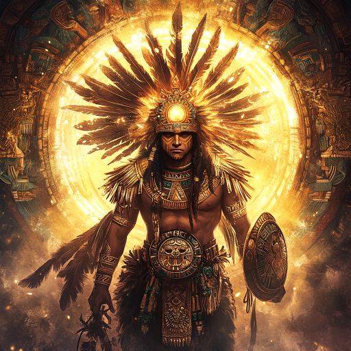
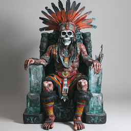
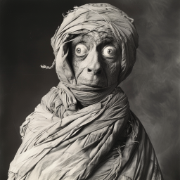
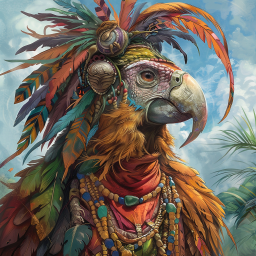
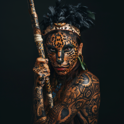
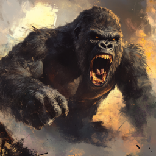
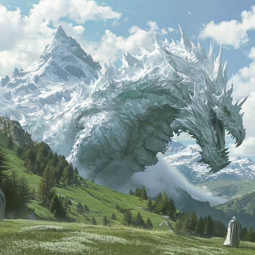

# Persongalleri

## Mannskapet

### Dan

### Galem

### Ilnan

### Xavez

### Kapteinen

### Styrmannen Gerald Clarke

### Seilmakeren Ferdinand Burke

### Navigatøren

### Kirurgen Veronica Farrow

### Kalle
### De andre som overlevde
### Purseren Jolly

## Fra oldtiden

### Leopardmannen 

### Frostånden Ixkayotl
### Vulkanånden
### Mørkeånden Xibalba
### Solånden Tonatiuh

### Ay-Etharia / skogens skygge
### Oxmal
### Dypets ånd Yaku
### Jordånden / det største treet i jungelen

### Ånden for aske og ødeleggelse Tzitzimime

## Geitefolkene

### Necromancere

### De åtte som ga oppdrag
#### Icanchu, som ønsket å drepe ogrene
#### Yacuruna, som behandlet de syke
#### Sicania, som sendte dere til groven

#### Intiapa, som trengte is til navngivningen

#### Kukulkan

### Han som tok dere til kjempegeiten
### Eneboeren ved isbreen
### Den gamle geitemannen som ble begravet

## Flyktningene som døde i ørkenen

### Karan, stifinneren
### Gerkin

## Fjellklanen

### De udøde

#### Dronning Nicté
#### Dronning Chaac
#### Hun med hvitt ansikt som rev ned taket

#### Han som stod oppe på fjellet ved krystallsirkelen

#### De fire andre dronningene

### Tlacaelel / Tlaca, alkymisten

## Fuglefolket

### Han som ble korrumpert i kjelleren

### Sjefsfuglen

### Heltekrigeren

### Fraktefuglene

## Menneskene i eldre tid

### Necromanceren som vekket Nicté

### Han som prøvde å ta makten fra obelisken

### De tre kultistene i kjelleren
### Den lubne presten
 

### Prestedamen som er moren til K'inich

### Krigerdamene

### K'inich

### Xipe Totec, den udøde vokteren av gravkammeret

### Konen til Xipe Totec
### Herbalisten

## Ogreklanen

### De to som bodde for seg selv
### Hun som kom på besøk
### Shamanen

## Gorillaene

### Kjempegorillaen

### Gorillaen som Xavez sin sjel gikk inn i

## De som kommer på de flygende skipene / Chaneques

### Han som laget film om å vekke de døde
### Det flygende trollet

## Dragen
