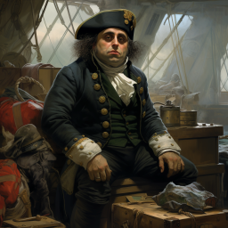
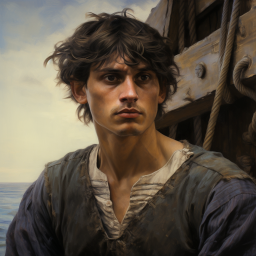
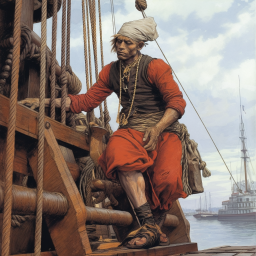
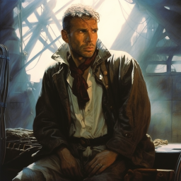
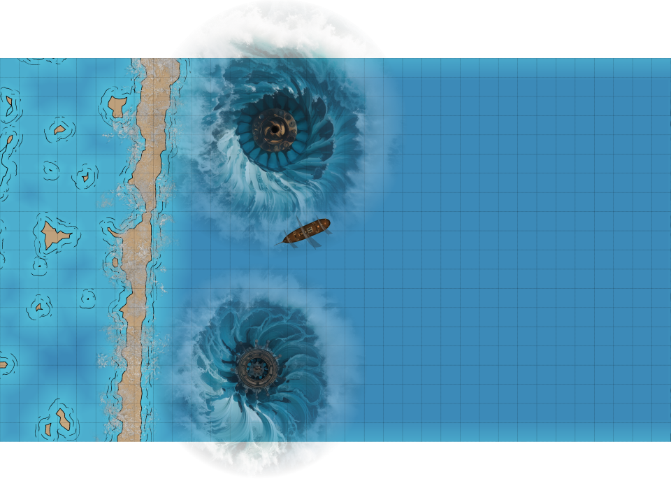
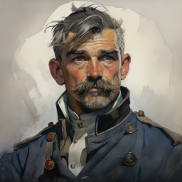
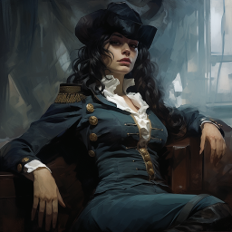
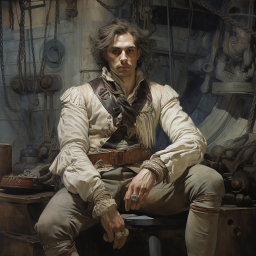
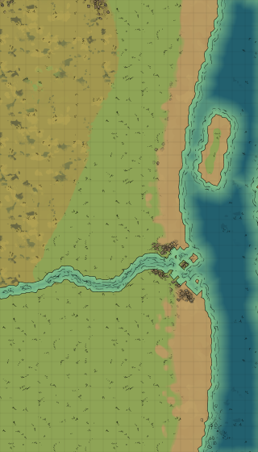

# Første spilleomgang: fra båten til stranden

Spillere: Dan (Eric), Xavez (Flemming), Ilnan (Håkon) og Galem (Jørn)

 

 

Dere var tre uker inn i ekspedisjonen, da dere tydelig var på vei inn i en storm. Kapteinen samlet alle til en liten motiverende tale, men raskt ble været så dårlig, at det mest handlet om å holde seg i live. Seilene måtte reves og egne stormseil heises opp. Under dekk var det forsyninger og kanoner som hadde slitt seg. 

Dan og Xavez fikk kontroll på forsyninene, inkludert en ku som løp omkring på nederste dekk. Ilnan og Galnen fikk heist stormseilene.  Etter hvert knakk likevel hovedmasten, og traff kapteinen, som ble hardt skadet. Selve skipsrattet ble også ødelagt, så det ble vanskelig å styre skipet.

Skipet kom inn i et område med mindre vind og bedre sikt, men med enda større bølger. Noen digre slags hjul spant rundt nede i vannet og laget bølgene. Dan og Ilnan la merke til at de store hjulene laget en slags hjerteslag nede i vannet. 

Skipet var på vei til å bli knust, men Galem og Ilnan (?) klarte å improvisere en ny styremekanisme, slik at dere fikk skipet helt inn til et rev før det ble knust. Derfra havnet alle i vannet. Med god innsats, spesielt fra Xavez, klarte dere å redde styrmann Gerald Clarke, kirurg Veronica Farrow og seglmaker Ferdinand Burke opp på revet. Det var også noen andre fra mannskapet som klarte å komme seg i land.

  

Dere forsøkte å komme dere innover mot fast grunn, men ble angrepet av noen fæle monstre, som Galem senere har kalt for gremlinger. Noen var piggete og lå på sandbunnen. Andre kom svømmende og brukte noen merkelige krefter for å forsøke å drukne Galem. Til slutt klarte dere å drepe alle, men dere så at det kom en hel skokk av lignende skapninger fra nord og plyndret skipsvraket.

Inne på selve stranden så dere mer av landskapet. Det var en lang sandstrand, palmer og klipper. I tillegg til de tre offiserene, møtte dere de fire andre sjøfolkene som hadde overlevd.

 
