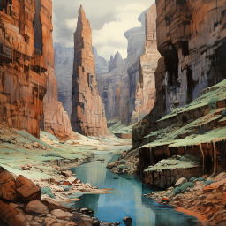

# Andre spilleomgang: Første utforsking, og en leopard-mann

Dere overnattet på stranden. Neste dag fant dere noen vrakrester i sjøen, inkludert et seil og Galem sitt trekkspill. Deretter dro dere innover i landet, og fant et område med jungel hvor dere ble overfalt av en diger tusenbein. Den forgiftet Ilnan, som nesten døde. Dan forsøkte å hjelpe, men det var litt usikkert om det var mer til hjelp eller mer til skade.

Innenfor jungelen, fant dere noen smale daler, med små bekker. 

Det var noen langhalsede sauer der, men Galem klarte ikke å skyte dem. De virket veldig vare. Dere fant et rart lys, fra en krystall inne i en fjellvegg. 

Dagen etter fikk dere de andre med opp til dette området, og laget en ny leir på et litt bedre sted. Deretter utforsket dere mer i området, og fant et kammer inne i fjellet med fire sarkofager av krystall. Galem rørte den ene, og kom til en annen versjon av kammeret hvor det var noen bord og en rar mann med leopardansikt, som snakket uforståelig. Neste gang ble alle med, men det var vanskelig å kommunisere med mannen, og dere kom tilbake til der dere kom fra. En tegning hadde dukket opp på steintavlen i kammeret, av en mann med horn og noen skapninger.

Dere rørte ved sarkofagene, dro tilbake til leopardmannen, og fant ut at det var en kar med fjærpryd og et litt spesielt spyd utenfor, og noen vandrende lik. Han virket veldig aggressiv. 
