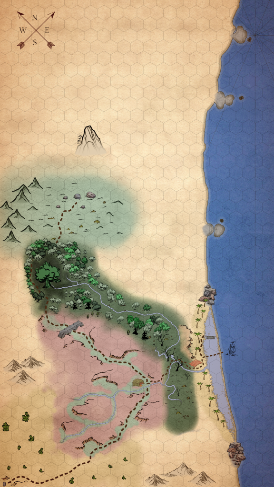
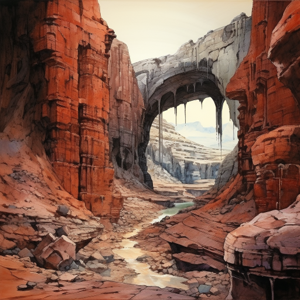
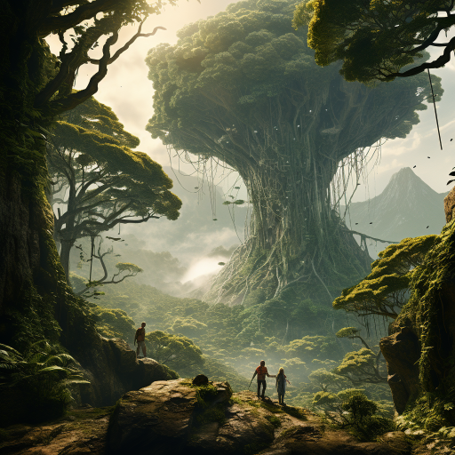
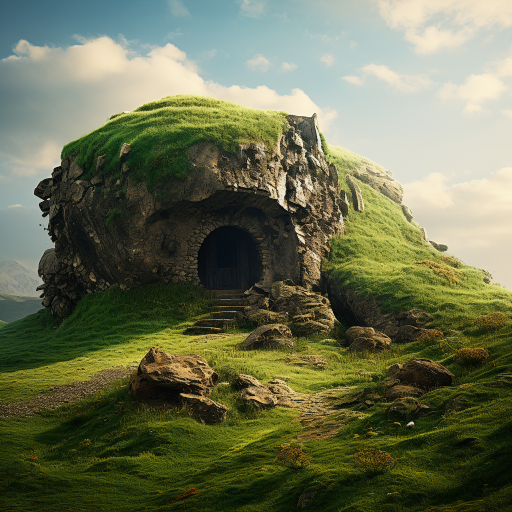
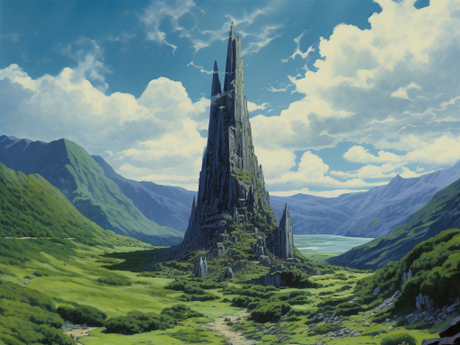

# Sjette spillomgang

## Dag 15 (fortsatt fra forrige spilleomgang)

Galem fikk en stor fisk i sumpen. Alle fikk medisinsk hjelp av Dan og kom seg litt. Dere satt i nærheten av den gamle statuen til dere kom dere ordentlig på beina igjen. Etterpå gikk dere ned på stranden, og plukket noen kokosnøtter. Galem laget en veldig fin ryggsekk av noen palmeblader. Dere gikk derettert tilbake til leiren med mer oppfyringsved, og snakket med de andre i mannskapet. Alle ble enige om å bryte opp leiren og følge kartet som var dukket opp på steintavlen. 

## Dag 16

Alle var klare til å dra avgårde. Alt fra leiren ble pakket unntatt steiner o.l. Galem fant noen løk i den gamle kjøkkenhagen, som han tok med. Dere kom fram til den merkelige broen. Den krysset dalen som dere gikk i, rett før terrenget ble grønnere og mer fruktbart. Oppå broen var det risset inn fuglemenn (som kastet lyn), menn med horn, tilsynelatende vanlige mennesker og vogner med krystaller i. 

## Dag 17

Dere sov godt og våknet til soloppgangen. Noen av dere jaktet på noen langhåree kaniner som fantes i store antall. Etter hvert kom dere inn i en tett og våt skog, og fant et gigantiske tre. Dere var ganske trygge på at dette var treet som var tegnet inn på kartet. Etter at dere hadde slått leir noen timer unna treet, dukket det opp tre svære gorillaer. De slo ut Ignan, men dere klarte til slutt å ta dem. Dere hørte noen forskrekkelige lyder i retning det gigantiske treet. Dere flyttet dere i mørket, deretter overnattet dere i jungelen. Det var fortsatt gorilla-lyder, men ikke i nærheten av dere. 

## Dag 18

Dere kom fram til steinhusene ute blandt åsene. I området lå det noen skrotter av lalamaer. Det var både bite- og kloremerker på dem, og det virket som de delvis var spist opp. De fleste husene var ødelagt, men i ett hus var det to rampete ogrer. De tok nesten livet av dere, og lo godt. Rapieren og kniven til Dan ble liggende igjen utenfor ogre-huset. Lenger nord kunne dere se et slags naturlig steintårn, som dere tenkte kunne være destinasjonen deres.

