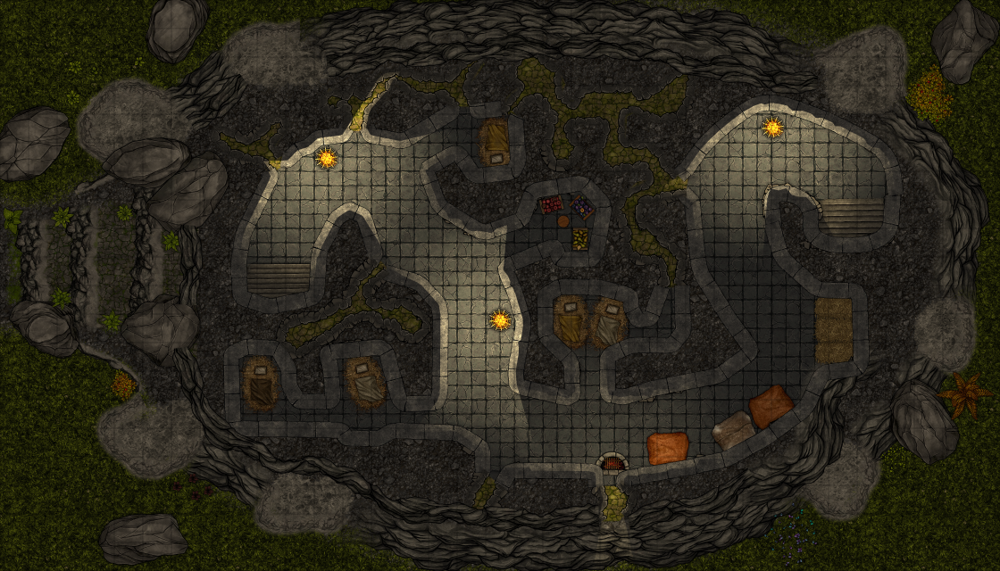

# Andre etasje

## Dag 21

<!-- img src="images/goatwoman_mini.png" alt="Icanchu"/ -->

Geitedamen i første etasje, Icanchu, tok dere til side så ingen andre skulle høre henne, og lærte dere sangen sin:

<iframe width="420" height="315" src="https://github.com/Mammux/sessions/assets/325898/da5798f8-0894-4db8-af9b-45ac12932015" frameborder="0" allowfullscreen>&nbsp;</iframe>

    Ix Nimraq chiri' ri u chikoponik, u chitzaqal, tz'ayin, k'ut xkik'otxel

Så viste hun dere veien opp i andre etasje, og introduserte dere for en eldre geitemann. Han het Kukulkan. 

Det ble tydelig at geitemennene
i denne etasjen sanket frukt og bær, og forsynte de andre geitemennene. Men de var plaget av gremlinger som krabbet rundt i noen små og trange ganger.
Dere klarte å drepe noen, og fikk tak i to magiske pinner, den ene skadet og den andre intakt. Deretter tente dere et bål for å røyke dem ut, og 
tettet igjen åpningene så godt dere klarte med steiner og rusk og rask. Kukulkan var godt fornøyd og lærte dere sangen sin:

https://github.com/Mammux/sessions/assets/325898/42a0c55a-21ef-46ee-bfc9-b8776906318b

    Ri ab'aj tz'ikin chikoponik, utz'utz' q'ak'aslemi' laj wakami'el chwi'

<!-- img src="images/kukulkan_mini.png" alt="Kukulkan"/ -->

Deretter lot han dere gå videre til tredje etasje, men dere overnattet først hos ham siden dere var ganske skadet.
