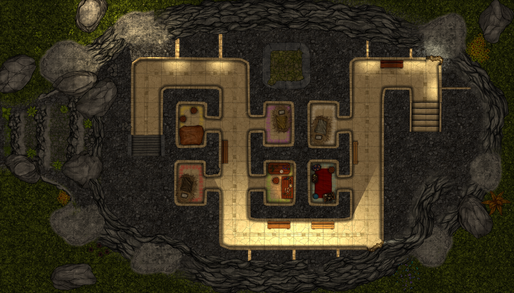
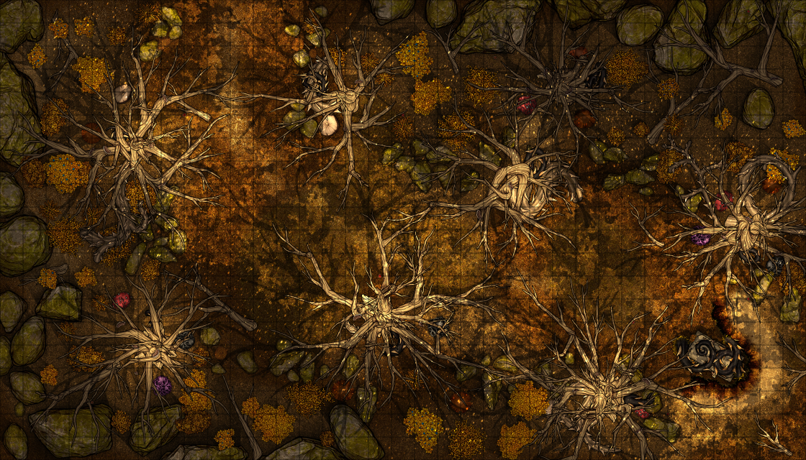
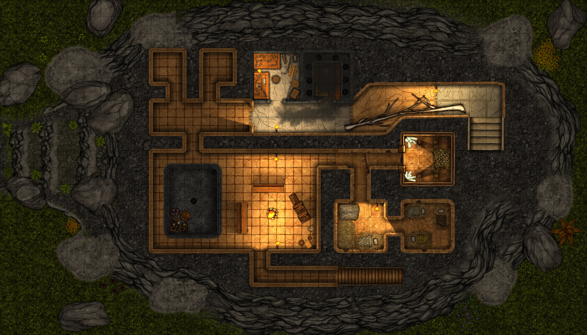

# Tredje og fjerde etasje

## Dag 22

Dere kom opp i tredje etasje og ble tatt mot av en geitekvinne som kalte seg Yacuruna. Det ble tydelig at hun hadde ansvaret for en
slags sykestue kombinert med aldershjem. Det var flere pasienter der. Det var en killinggutt med en vrikket ankel. En geitemann hadde 
mye blåmerker og klemmeskader, en annen alvorlige kutt og blødninger. Dere ble der noen timer, og Dan hjalp alle disse. 

En eldre geitemann satt på en benk og kikket ut gjennom noen solhull. 

Men det var også en annen geitemann som var syk. Han virket fryktelig svak, antagelig av noe slags parasitt. Etter hvert forstod dere 
på Yacuruna at hun trengte en helt bestemt sopp for å lage en kur for ham. Hun pekte nordvestover ut gjennom et solhull, så dere regnet
med at dere måtte gå i den retningen.

Etter å ha gått i tre kvarter kom dere til en fjellrygg, og så ut over en ganske stor løvskog. Dere la i tillegg merke til at det var et
område midt i skogen som hadde høstfarger, med gulnet løv. Dere gikk i den retningen og kom fram til et område
hvor det var litt kjøligere, og det var mye sopp og slyngplanter rundt nakne trær. Dere ble angrepet av en merkelig slyngplante-skapning,
men dere klarte å beseire både den og en blodtørstig busk. Dere fikk også med dere noen bær fra disse planteskapningene, og
en sopp som dere mente måtte være riktig.

Dere kom dere tilbake til pasienten, og Yacuruna virket godt fornøyd. Dere var skadet og slitne, og overnattet.

## Dag 23

Neste dag var pasienten blitt litt piggere. Yacuruna lærte dere sangen sin:

https://github.com/Mammux/sessions/assets/325898/e3332782-3abe-4734-ae8d-6f58563c21d7

    Ri utzukulil xub'anil, xqaq'oj chiri', ut ch'uti'iq xub'an q'ak'aslemi'

Så viste hun dere opp til neste etasje.

Der møtte dere geitemannen Sicania. Han tok dere med inn. Dere gikk først forbi en utedo/innedo, hvor det luktet litt sur røyk. Deretter
en snekkerbu, hvor Galem tok med seg en øks. Så kom dere inn i et stort rom med noe som så ut som et basseng. Der hadde geitemennene frukt.
Lenger inne kom dere til et rom hvor det var lysende krystaller og en intrikat inskribsjon på veggen.

Mannen i midten var tydelig leopardmannen fra krystallkammeret. De to andre var vanskeligere å identifisere, men dere skjønte etterhvert
at geitedamen fra sykestuen (Yacuruna) la friske blomster foran han til venstre. Han til høyre så nærmest ut som en etterligning av leopardmannen. 
Dere spurte Yacuruna om mannen til venstre, og hun pekte mot skogen igjen. Dere dro tilbake dit og havnet i kamp med ennå en voldsom slyngplante
som omfavnet en nedgravd steinkiste. Til slutt beseiret dere den, men Dan overlevde bare etter at Ilnan hadde fått et øyeblikks inspirasjon
fra en gammel sjel akkurat i det øyeblikket Dan holdt på å trekke sitt siste sukk. Dere fikk med dere noen blomster fra planten dere hadde
beseiret, så begynte Galem å åpne lokket på kisten.
