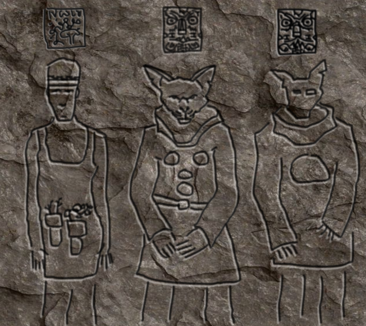

# Ut i kulden

## Dag 22

Dere var ute i skogen, i den lokale høsten som fortsatt fantes i dette lille området hvor dere kjempet mot forskjellige
agressive slyngplanter. Galem fikk hjelp til å knekke opp stein-sarkofagen. I den fant dere et menneske-skjelett, men
hele sarkofagen var full av bleie, tynne, visne røtter. Et skarpt øye la merke til et var et område som ikke var fylt inn 
av røttene, og det hadde form som et slikt personlig symbol som dere har sett flere ganger. Det ble klart at dette
var symbolet til mannen på venstre side av inskripsjonen i steintårnet.

Dere tok ut avtrykket av symbolen, og tømte kisten for røtter. Så ryddet dere litt opp i området, og dro tilbake til
steintårnet. Da dere la dere for kvelden, drømte dere om begravelsen til mannen dere fant. Det var vakre trær og flotte
blomster i det lille skogholtet. En veldig fredelig stemning omfavnet alle der, mennesker og fuglemenn, da kisten
ble gravd ned.

## Dag 23

Dere reiste tilbake til skogholtet og ryddet hele dagen der slik at stedet begynte å få tilbake noe av den fredelige følelsen
fra drømmen dere hadde delt. Etter hvert oppdaget dere at det var noen slags kraft som hjalp dere. Blomster spirte
på minutter, og sollyset ble kraftigere. Dere samlet så mye død ved som dere klarte og tok det med tilbake til tårnet.
En ungdom fra geitemann-stammen hadde set hva dere hadde gjort, og formidlet det til Sicania, som sang sangen sin til dere.

<iframe width="420" src="video/song-04.mp4" frameborder="0">&nbsp;</iframe>

    Ri utzukul k'ut xub'an q'ak'aslemi', xub'an chik'in, u xub'an k'ut tz'utujil

Han tok dere med opp i neste etasje, hvor dere ble møtt av den velkledde Intiapa. Det var et veldig åpent rom, med hull ut 
på fire sider. Midt i rommet var det et mystisk lys, og vakre mønstre med gull på gulvet. To ungdommer var også der. 
Intiapa ga dere i oppdrag å hente is fra en isbre. Da dere etter en ganske tung tur med mye oppoverbakker kom fram der,
fant dere også en liten hytte som lå helt inntil breen. Døren var knukket av hengslene, men inne lå det massevis av ved
og et par dusin fakler. Det var også en seng. 

Dere skimtet at geitemennene hadde hentet ut is litt lengre oppe, så dere gikk dit. Dere hentet is, og etter at mørket senket
seg så dere at det var noen slags lysglimt inn i breen. Dere tenkte dere fram til at det kunne ha vært små krystaller 
som var kommet inn i isen og slapp ut lys fra fortiden. Dere gikk opp på breen for å utforske mer, og ble overfalt av et
fælt frost-troll med en kraftig øks. Det helbredet seg i ett sett, men til slutt fikk dere tent en fakkel og klarte
etter mye strev å få drept det for godt med et bål bygget med ved fra hytten.

Dere gikk tilbake til hytten. Dere la merke til en merkelig tegning på veggen som tidligere var skjult av veden.
Etter hvert la dere dere til å sove, men midt på natten våknet dere av breen flyttet på seg. En stor rund
åpning hadde dukket opp som gikk inn under isen.

