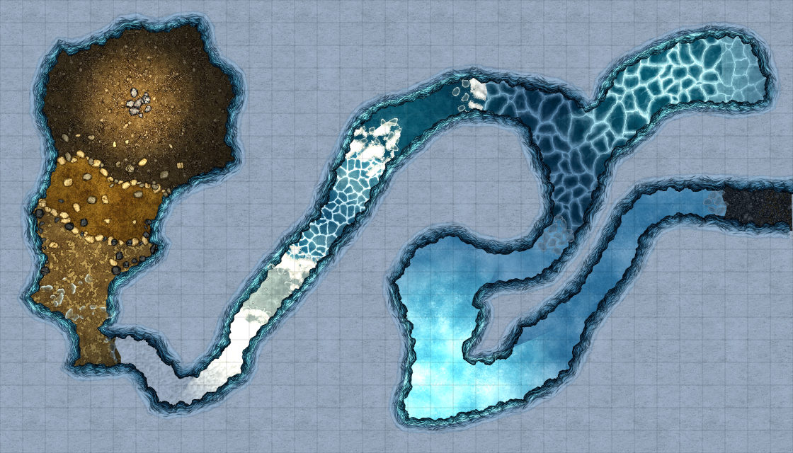
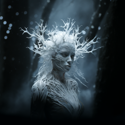
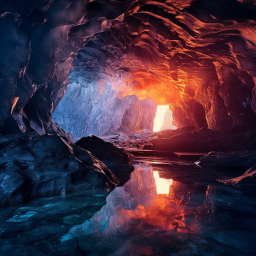
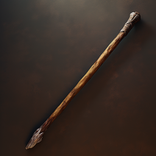

# Under isen

## Dag 23 (natten til dag 24)

Dere våknet midt på natten av at breen beveget seg. Dere var fortsatt hardt skadet etter kampen mot istrollet, men våget dere likevel inn i tunnelen under isbreen. 
Det var tydelig at breen hadde beveget seg for å lage denne gangen, med vegger av grov is. Dere så fortsatt små lysglimt fra krystaller som var fanget i isen rundt dere.
I det første lille kammeret dere kom til, var det istapper i taket som dryppet vanndråper ned i vannet på gulvet. Dere var litt usikre på om istappene var
helt naturlige, så dere kastet økser og forskjellig på dem. Da ble de til isslanger, men de angrep dere ikke tilbake. Da dere nærmet dere krøp de inn i isveggene
og forsvant.

Litt lengre framme ble det plutselig voldsomt kaldt. Vannet på gulvet frøs til is og dere måtte være smidige så dere ikke frøs fast. En mystiske kvinneskikkelse
dukket opp inn i bre-isen, det virket kanskje som hun ønsket at dere skulle gå videre. 

Rundt neste sving møtte dere på en liten gruppe udøde skjeletter. De fleste
var geitemenn, men en var et menneske. Det lå også et lik av en geitemann der. Dere nedkjempet de udøde skjelettene. Noen satt også fast i isveggene og ble
spist av isslanger. Dere fikk med dere litt utstyr fra menneskeskjelettet. 

Liket som lå der var en geitemann, vanskelig å se hvor lenge han hadde vært død. Han hadde utstyr for kaldt vær, inkludert fakler og en enkel men fin isøks. 

Dere fant ut at det ble for dristig å gå videre uten å være litt friskere, så dere gikk tilbake til hytten og brukte et par timer på å behandle sår og skader.
Da alle var i rimelig grei form, dro dere innover i hulen igjen. I neste tunnel så dere noen store krystaller nede i isen under dere, som hadde fanget et slags
kaleidoskopisk bilde av et eller flere merkelige skip som kjempet mot en stor hvit drage uten vinger. Den hadde bare noen stumper der hvor vingene skulle vært
slik dere kjenner drager fra bilder og historier. Det virket som om dragen forsøkte å beskytte noe, men dere kunne ikke se hva. Etter et par minutter ble krystallene
truffet av noe som ble skutt fra skipet, og bildet forsvant.

Lengre framme var hulen opplyst av flammer, men det viste seg da dere kom inn at det var et litt større kammer hvor alle krystallfragmentene i isen viste
bilder av et flammehav. I selve hulen var det en gruppe skjeletter, inkludert to som hadde magiske krefter. Det ene magiker-skjelettet stod og forsøkte å trekke en
mørk trestav opp av en stor haug med svidde bein og hodeskaller. Det ble en hard kamp, skjelettene var vanskelig å skade - alle krigerne hadde brynje, og
både stikk og kutt var lite effektive. Til slutt klarte dere å ta dem alle, med bl.a. Dan sin imponerende kjappe behandling av Ilnan sine store syreskader fra
den ene magikeren.

Etter at skjelettene var bekjempet, begynte dere å samle utstyr, og Dan trakk spydet ut av beinhaugen. Da begynte hele isbreen å rase sammen. Dere måtte løpe
for å rekke å komme dere ut før isen raste sammen til en slags grov slush. 

## Dag 24

Solen var allerede på vei opp da dere kom ut, så dere hentet isen dere var bedt om og dro tilbake mot steintårnet. Der fikk dere avlevert isen, som ble brukt
til å lage en deilig sorbet. Den ble servert i et rituale hvor de to geitemann-ungdommene holdt opp ogre-hodeskaller og sa sine navn for første gang. Dere
fikk også lære sanglinjen til Intiapa. 

<iframe width="420" src="video/song-05.mp4" frameborder="0">&nbsp;</iframe>

    Ri siba' q'ak'aslemi', chiri', chawisib' ri' xuk'ij laj chiya' xub'an

Da dere la dere på kvelden, drømte dere alle om at frostkvinnen fra isbreen stod ved et vakkert kaldt fjelltjern og 
så ned på isbreen som var på vei til å smelte. Hun så på dere og bukket, kanskje med respekt eller takknemlighet. Neste dag planla dere å gå videre opp i tårnet.
