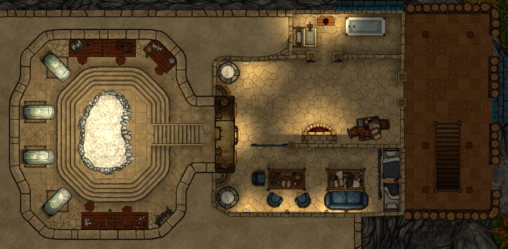

# Hjelp, vi er på tidsreise (igjen)

Etter at dere hadde fått den siste sanglinjen av den eldste geitemannen, tok
dere dere en natt i sykestuen og fikk tatt knekken på de stygge infeksjonene
dere hadde skaffet dere. 

## Dag 133

Dere fikk hjelp av geitemennene til å komme dere opp til den aller øverste etasjen. 
Der var det en ganske stor plattform, med en gigantisk metalldør med diverse
rør og mekanismer. Dessverre var det ingenting dere klarte å manipulere på noen måte,
men etterhvert kom dere på å synge sangen som dere hadde lært mens dere løste
de åtte oppdragene fra geitemennene.

<iframe width="560" height="315" src="https://www.youtube.com/embed/Oo27fhzkwgM?si=0n-jo2EVuJp908Gb" title="YouTube video player" frameborder="0" allow="accelerometer; autoplay; clipboard-write; encrypted-media; gyroscope; picture-in-picture; web-share" allowfullscreen></iframe>

Da begynte det å bevege seg inne i metalldøren, og etter en stund åpnet den sentrale
delen seg slik at dere kunne se inn i et kammer. Der inne var det en svær krystall 
som gikk fra gulv til tak, og fortsatte oppover helt til toppen av hele spiken. Inne
i krystallen skimtet dere en drage som beveget seg sakte, og den begynte å snakke til dere!

    Tidens sand renner fort, ennå ankommer dere både sent og tidlig i dens strøm! 
    Nå er øyeblikket til å ruste seg for mørkere tider, enda usett. 
    Mye står til å gjøre, mye burde allerede vært gjort. 
    Min æra ebber ut og har knapt grydd. 
    Leopardmannen, jeg ba ham lede deres vei; hans epoke endte, han forsvinner fra synet. 
    De nærmer seg, som i gamle dager. 
    Dere må både reise tilbake til dem som falmer fra sin tid, og søke ut ham som ennå ikke har sett dagens lys.

Etter dette, forsvant den opp i den delen av krystallen som ikke var synlig for dere.
I rommet var det også noen skjeletter, og fire krystallsarkofager, og dere så at det 
faktisk var de samme fire som dere fant i kammeret inne i fjellet for fire måneder siden. 
Skjelettene virket å være av en mann og to kvinner, og var svært gamle.

Sarkofagene lyste, og dere stilte dere hver ved deres "egen" sarkofag og berørte dem. Som før, 
ble dere transportert til en annen tid. Dere våknet med noen enkle små masker på dere. Utenfor 
kammeret hørte dere stemmer som snakket. Dere innså at dere nå skjønte betydningen av sangen
geitemennene hadde lært dere:

    In a city of ruins, they stand, those goatmen, strong and wise 
    Near the peak of a stone spire, where echoes of the past arise 
    Their shaggy coats, each one unique, their watchful gaze, no compromise 
    Each goatman's charge, a single line, a key to what the past belies 
    The chamber's secret, so divine, where iridescent beauty lies 
    A harmony, in voices, fine, unlocks the chamber's age-old ties 
    But guard it well, in whispered signs, the power hidden in crystal's guise 
    Beneath the moon's enchanting sign, in the ruins, their legends score 

Da dere kom ut møtte dere flere personer i noen ganske
luksuriøse rom; 

 - En litt lubben prest og to prestinner med intrikate leopard-masker.
 - Fire kvinnelige tjenere med enkle masker.
 - En kvinnelig kriger med leopard-tatoveringer og et langt spyd.

De virket ganske overrasket over at dere dukket opp, og nervøse for hva som var årsaken til
at dere var blitt tilkalt. Ute begynte været å bli dårligere. Dere fikk snakket litt med dem 
(særlig presten), og fant ut dette:

* De bor i spiken sammen med fuglemennene og geitemennene.
* Alliansen med fuglemennene ble inngått for ca. 40 år siden, og er litt skjør.
* Presten så som liten gutt at dere gikk ned i kjelleren og slåss med kultistene.
* Det var den ene prestinnen som komponerte den hemmelige koden og fordelte den hos geitemann-familiene.
* De kjenner til den udøde dronningen, og tror at hun bor under bakken et sted.
* Gravkammeret har blitt bygget, og Xipe Totec vokter det sammen med et fuglekvinne (men han er ikke udød).
* De kjenner godt til maleriene i etasjen under, men ikke detaljene i historiene som fortelles.
* Leopardmannen (som de også kaller Oppfinneren) døde for nesten 30 år siden og er begravet i gravkammeret.
* Alle holder seg unna isbreen mot vest, pga. den illsinte frost-ånden som finnes der.

 

  
Dere holdt fortsatt på å spørre spørsmål, da en gruppe fuglemenn angrep dere. Dere nedkjempet
først noen ganske ordinære soldater, men en "helt" dukket opp, så dere og fløy bort.
Dere hørte lyder fra kamp i etasjen under, og løp ned trappen. I etasjen med veggmaleriene var det 
flere fuglemenn-krigere og en mystisk fuglekvinne med intrikat drakt. Det virket som om hun
hadde noe slags kontroll over stormen. Selv om også helten dukket opp igjen, klarte dere å drepe både 
dem og henne. 

Dere gikk videre ned og kom til det store seremonielle rommet. Der var det en hel flokk med fuglemenn,
mange av dem med mye mer fargerike fjærpryder enn dere har sett før. Den største av dem var diger,
på størrelse med en ogre. Han stoppet krigerne, og begynte å forhandle med dere. Han mislikte
virkelig den lubne presten på toppen av spiken, men gikk med på å avslutte myrdingen da
han skjønte at dere hadde en spesiell forbindelse til leopardmannen. 

Dere ble trukket tilbake til deres egen tid. Galem rakk såvidt å sette seg i leopardmannens
stol i forhandlingsrommet.

