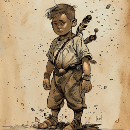
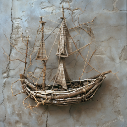

# En jeger i skyggene og en pinnebåt på land

Dere kom tilbake fra deres første tidsreise i det nye krystallkammeret. Det var ikke lengre skjeletter i kammeret, men det lå en liten skifertavle der med en intrikat inngravering.

Det så ut som en diger ogre og en ung gutt. Dere grublet litt på hva dette kunne være, men krystall-sarkofagene lyste bare helt svakt, så dere gikk nedover i tårnet for å se om noe hadde endret seg.

Dere ble litt skuffet da dere så at skadene var omtrent like store fortsatt, med noen små forskjeller her og der. Men geitemennene hadde forandret seg litt, noen av dem hadde fjær her og der i pelsen sin, og andre så mer "menneskelige" ut enn de gjorde før.

Da dere kom lengre ned, så dere også at inngraveringen av de tre figurene hadde forandret seg. Herbalisten og Leopardmannen var der fortsatt, men den tredje figuren var forsvunnet.

Dere møtte kirurgen fra mannskapet deres, Veronica Farrow. Hun fortalte at barnet som hun hadde i magen hadde blitt mer aktivt "plutselig". I likhet med andre hadde hun merket at dere hadde reist i tid. 

Dere pratet også med en av de andre sjøfolkene som fortalte dere at han hadde oppdaget noen stjerner på himmelen som ikke oppførte seg som de skulle. Han sammenlignet det med å se lys fra andre skip i mørket på havet. Han lovet å følge med på dem og gi dere beskjed.

Dere var også ute og snakket med styrmannen, Gerald Clarke. Han hadde fått et lite hus av geitemennene, og bodde litt unna selve tårnet. Det virket som han hadde blitt en naturens mann, og dere leverte bl.a. en bra bue til ham. Det virket som han trivdes best for seg selv, og spesielt ute på lengre turer.

På ettermiddagen dro dere ut og drepte de to ogrene som hadde gitt dere så mye trøbbel da dere først kom reisende. Det ble etterhvert opplagt for dere at for å redde gutten fra ogrene, måtte dere tilbake i tid.

## Tilbake for å redde gutten

Neste dag var det godt med lys i sarkofagene. Da dere kom tilbake til fortiden, var mye som forrige gang, men det var fred mellom menneskene og fuglemennene. Det virket som det hadde gått en del år. Sjefspresten var død, men den kvinnelige presten dere møtte sist tok ordet. Da dere begynte å spørre om gutten og ogrene, fikk dere vite at han het K'inich og var sønnen hennes. Han var født under en solformørkelse, fortalte hun, og var en spesiell gutt. Dere bet dere merke i at hun kalte månen for Nattblomsten.

Hun ba dere skynde dere for å hjelpe sønnen hennes. På vei til ogrenes landsby skjedde det noe rart. Skyggene fra trærne rundt dere strakk seg utover og det føltes som skumring på høylys dag. Dere ble var en skikkelse ved et av trærne.

Han presenterte seg som Ay-etharia, jegeren som skjuler seg i trærnes skygger. Han fortalte at K'inich var hans utvalgte, og den eneste som bandt ham til virkeligheten. Han hadde vært "strandet" i mange mange år vest for ørkenen, uten å kunne komme seg tilbake til menneskene. Bare solformørkelsen hadde gjort det mulig. Dere så også at han hadde et kogger med piler som minnet om staven dere fant under isbreen. Da dere spurte om dette, fortalte han at han hjalp menneskene å lage staven som dere fant. Dessverre ble den brukt til å binde en ånd med stort sinne, som førte til store ødeleggelser og død for de fleste mennesker (inkludert de to som gir Dan magien hans).

Dere dro videre til ogrenes landsby. Der fant dere gutten sammen med noen vesener som var mindre enn ogrene men like stygge. Det var også et merkelig skip dere, som så ut som det var bygget av pinner, men som svevet rundt i luften! Dere angrep, og fikk dradd med dere gutten, men i tillegg til hobgoblinene, kom både ogrer og det flygende skipet mot dere. Skipet skjøt også ut noen pinner som en slags piler. Heldigvis dukket Ay-etharia opp i skyggene, og skjøt en pil på pinneskipet som sendte det rett i bakken. 

   

Ilnan ble modig stående igjen og dekket retretten, og han falt, men alle andre kom seg unna. Ganske snart ble dere også trukket tilbake til nåtiden.

