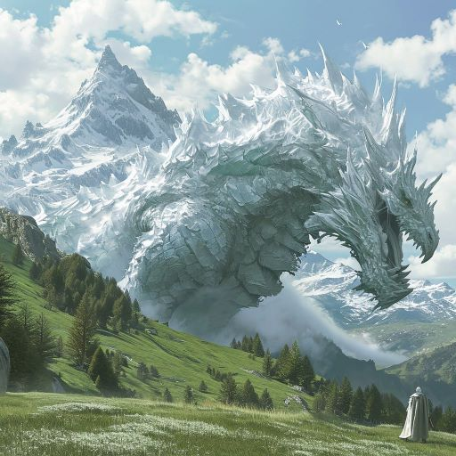
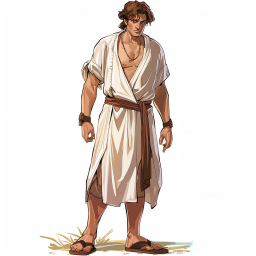
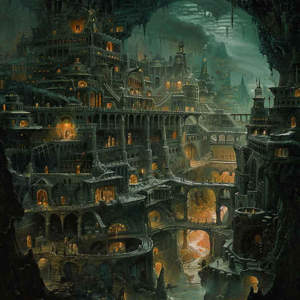

# Spenning i Dragefjellene, i fortid og nåtid

## Kamp mot kjempedragen

I fortiden, fant dere K'inich ute på sletten rett foran de store fjellene i nord. En enorm drage tårnet over ham. Den var dekket med krystall-aktige skjell, og virket både sint og forvirret. Dere lurte på om den kunne ha samme tilstand (sykdom) som det store geitemonsteret dere slåss mot ved skipsvraket. Dragen hadde ikke vinger, men det var store arr langs siden, som om de hadde blitt kuttet av eller ødelagt på et tidspunkt. 

Det var en kort men dramatisk kamp mot dragen, hvor dere tydelig merket en uimotståelig frykt så snart dere kom i nærheten av den. K'inich snakket til dragen, det virket som han forsøkte å snakke dragespråk, og dragen nølte litt, men angrep likevel. Dere klarte med heroiske innsats å beskytte ham mot dragens pust av knivskarpe krystaller, og etter hvert gravde den seg ned i bakken og forsvant. Galem fikk inn et skudd på den som så ut som det faktisk gjorde en del skade, men bortsett fra det hadde angrepene deres liten effekt. Dragen etterlot seg et underjordisk spor av krystaller, slik dere har sett rester av før.

Etter at faren var over, løp K'inich bortover og gravde i bakken. Dere begynte å bli trukket tilbake til nåtiden, men han fant noe som så ut som rester av skallet på et krystallegg. Han knuste det til pulver i hånden, og blåste det opp i luften. Da virket det som om dere fikk en liten utsettelse av returen til nåtiden. Dere la merke til at dette eggeskallet hadde en annen fargetone enn noen av de andre krystallene dere har sett (som alle har samme farge som dragen dere nettopp ble angrepet av).

## En god prat

K'inich forsøkte å få snakket så mye som mulig med dere i løpet av den korte tiden som gikk før dere ble trukket tilbake. Han fortalte at han hadde kommet opp for å forsøke å snakke direkte med dragen, fordi dragen i krystallen i steintårnet var vanskelig å forstå seg på. Så håpte han også det skulle føre til at dere ble trukket tilbake i tid. Leopardmannen hadde ikke lært dem nok om tidsreiser til at de kunne kontrollere sarkofagene, bare nok til å vedlikeholde dem.

Han fortalte at på stedet dere stod, hadde det vært et annet steintårn, og et drageegg, men at det var knust for lenge siden. Han mente at det var skjedd ved et angrep fra de flygende skipene. Han var bekymret for at et nytt angrep var forestående, men dere kom sammen fram til at det antagelig ikke var skjedd i løpet av tiden fra hans tid til deres tid. 

Han fortalte at det var et annet angrep for mange år siden, hvor menneskene hadde fanget en ildånd i staven som Dan har i nåtiden. Den hadde gjort det mulig for dem å skyte ned et flygende skip, men hadde også nesten utslettet alle menneskene. Dette kjente dere igjen fra veggmaleriene i tårnet. Bare med hjelp fra leopardmannen (og dere), var det noen som overlevde. 

Dere fikk også snakket om noen andre ting; dere nevnte skipsvraket (hvor dere slåss med geitemonsteret), og han kjente ikke til det men virket interessert. Han nevnte at geitemonsteret i hans tid var en stor sterk hjelper for de vanlige geitemennene, konstruert av fuglemennene.

Han hadde forsøkt å utforske de store bygningene med halvferdige steintannhjul, lik dem som ligger i havet og lager stormer, men ikke funnet ut så mye.

Dere snakket om de udøde, og han sa, som han andre har gjort før, at de antagelig finnes under bakken et sted. Han hadde hørt flere rapporter om at de var sett nord i skogen, og anbefalte at dere forsøkte å finne ut mer i deres tid.

Den store gorillaen i skogen var en plage også i hans tid, han visste dessverre ikke noe mer om den. Han spurte om dragen fortsatt var i live i deres tid, dere var usikre men trodde kanskje det. Det var det siste dere fikk sagt før dere ble trukket tilbake til nåtiden.

## Skrekkskalle

Tilbake i krystallkammeret fant dere en skifertavle med en enkel skisse av en hodeskalle, men sarkofagene lyste bare veldig veldig svakt. 

Dere gikk litt rundt, det var ikke noe nytt i tårnet såvidt dere kunne se. Chavez laget seg en rustning med K'inich sitt symbol. Dere bestemte dere etter hvert for å reise opp til stedet hvor dragen angrep dere i fortiden. Der fant dere begravd en liten kiste med K'inich sitt symbol på, med noen biter av drageegget. 

Dere lette litt rundt i dette området, og fant noen steder hvor elven som renner der var bygget inn. Etter å ha speidet litt opp mot fjellene uten å finne noe, gravde dere dere ned og laget et hull i "elvetaket" slik at dere kom dere inn til den underjordiske elven. Det var små stier langs elvebredden, og i vannet lå det beinrester. 

Dere beveget dere oppover mot fjellene, og kom til slutt inn i en stor hule, opplyst av sollys filtrert gjennom snø og is mye lengre oppe. Det var en masse opplyste bygninger. Dere er helt på det laveste nivået.

