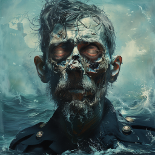
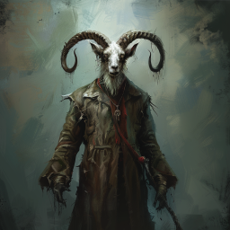
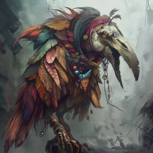
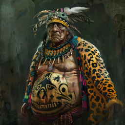
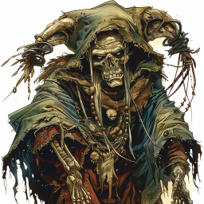

# Du må starte på gølvet

Dere var såvidt begynt å utforske den mørke byen inne i fjellene da dere oppdaget forskjellige udøde omkring dere, og havnet i kamp med dem. Det var tydelig at det var flere forskjellige typer, og de fleste var aggressive. 

*Frostskjeletter* som lignet på dem dere møtte under isbreen. De var vanskelige å ta livet av, men virket ikke så farlige.

Et *skjelett* (eller kanskje en veldig tynn zombie), som satt og fiklet med noen gule steiner da dere fikk øye på ham.
 

De druknede og reanimerte likene av kapteinen (Bernie) og purseren (Jolly), som dere sist så bli slukt av bølgene ette forliset. Dere ble lammet av sorg et øyeblikk da dere så dem, men tok dere sammen og slo dem ned.
 

Dessuten var det en geitemann av relativt skummelt utseende, som kanskje ikke var udød, men dere drepte dem likevel. Med seg hadde han noen udøde, inkludert Gerkin and Karan! Det var de to forfedrene som Dan får magien sin fra. Da de så Dan ble de med på deres lag, i alle fall inntil videre!
  
 

Noen *udøde fuglemenn*, som minnet om dem som bar dere ut i skogen i fortiden. De hadde også med seg en liten *udød fugl*. En av dem hadde ikke bein, ryggraden bar hang og dinglet. Disse tok nesten livet av Ilnan, men Dan reddet dagen igjen med risikabel kirurgi! 
 

Et par *tjukke zombier* av menneskeprester. Den ene kjente dere igjen som leopardpresten som møtte dere første gang dere reiste tilbake i tid i steintårnet.
 

En *udød ogre*, som Ilnan kastet ned på bakkeplanet med voldsom kraft. Den ble knust mot steinene ved elven.

En udød hobgoblin shaman, den samme som dere slåss med hos ogrene, hun som kontrollerte pinneskipet og hadde kidnappet K'inich.
 

En *zombie* bundet fast til en stor tromme, som fikk ordre om å sette i gang å tromme av en annen udød, og satte i gang en prosess hvor dere hørte et maskineri som beveget seg i fjellet, det kom lys i den øverste bygningen, og gitteret låste seg foran inngangen dere kom inn gjennom.

Til slutt hadde dere overvunnet alle de udøde nede på laveste etasje. Opp mot lyset fra taket i hulen, så dere at noen digre flygende skikkelser sakte sirklet ned mot dere.

