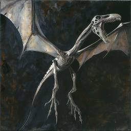
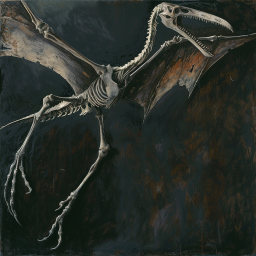
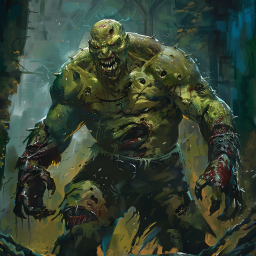
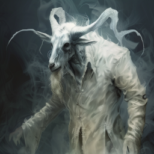
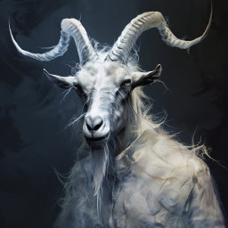
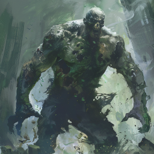

# Gå i kjelleren

Dere hadde søkt dekning inne i en av bygningene på første etasje i de undødes by. Det var ikke så mange udøde rundt dere, men da dere gikk ut, kom de flygende skikkelsene ned og angrep dere. De var digre  skjelett-skapninger, som fra en svunnen tid. En plukket opp Xavez og slapp ham fra stor høyde, men det virket ikke å ha så mye effekt. Han rullet bortover bakken uskadd, og kom seg tilbake til huset.

Dere oppdaget også en diger udød type inn i et av nabohusene, men dere lukket raskt døren igjen og ungikk ham. Han dunket litt i døren, men det virket ikke som han klarte å åpne den.

Dere tok en pause og forsøkte å pleie sårene, da to geitemenn kom inn og angrep dere. De brukte ganske kraftig magi, bl.a. fyrte den ene av et lyn innendørs! De var levende, men da dere drepte den første, ble han om til et spøkelse, og dere måtte drepe ham på nytt. Den andre geitemannen, drepte Xavez så grundig med lysskade fra våpenet fra gravkammeret at han ikke kom tilbake som spøkelse.

 

I kjelleren fant dere et litt spesielt tegn på en stein i hjørnet, det var det alkemiske symbolet for salt. Dere fant også en hemmelig gang, og kom videre til en annen kjeller. Der var det en ny diger udød type. Han slo etter dere med maltrakterte kropper, men dere klarte å ta ham. En ny hemmelig gang ledet videre. 

