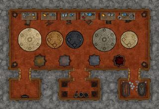
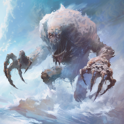
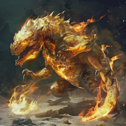
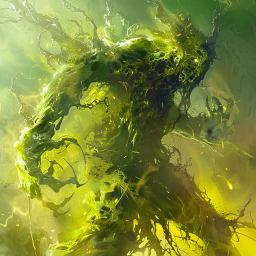
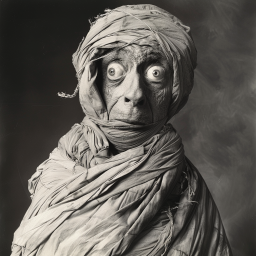

# En kjeller under kjelleren?

Dere fortsatte gjennom de hemmelige gangene nede under de udødes by, og fant et nytt rom med en udød skapning. Hvordan den var kommet dit var vanskelig å si, den virket for stor for gangen dere kom gjennom. Den var en enkel match, den virket enda tregere enn zombier vanligvis er.

Etter kampen oppdaget Galem en løs stein på gulvet, skjult blant alle de råtne likdelene som lå der. Da dere løftet den, fant dere en sjakt som ledet nedover, med stigetrinn av metall festet til veggen. Ett av trinnene var rustent, og løsnet da Ilnan skulle klatre ned, men han landet trygt likevel.

Etter hvert kom dere alle ned i et større kammer med flere siderom.

Dere brukte litt tid i det lille siderommet dere hadde kommet ned i, på å orientere dere, og helbrede dere etter de siste kampene. Men etterhvert forsøkte dere å gå inn i hovedkammeret. Da sprutet det fra den ene steinen i bakken opp et vesen bestående av salt, som angrep dere. Det hadde noen ganske smertefulle angrep, som tømte dere for væske, men dere klarte å overvinne det.

Fra en stein lengre borte dukket det opp en brennende skapning bestående av svovel. Det ble tydelig at det var forgiftning som var hovedtrusselen ved dette vesenet, ikke varmen fra flammene, men dere overvant også dette vesenet.

Fra den siste steinen, kom det bare noen dråper syre opp, og formet en liten skapning. Dere ødela den med bare et par angrep.

Det midterste siderommet virket som å være et rom med en serie kullfyrede ovner eller griller. I hovedkammeret var det en rekke bord med forskjellig alkemisk utstyr, men mye var knust. Det var også noen store kar i hovedrommet, som det kunne se ut som hadde inneholdt væsker en gang, men som nå var fullstendig tørket ut.

I det østligste siderommet, fant dere to store kar. I det ene lå det et skjelett, men i det andre så dere en innbandasjert skapning, som lå i en seig masse. På gulvet var det en masse store flasker, med litt slanter av en lignende seig masse. Dere rørte ved skapningen, som så ut som en mumie, og han begynte å bevege seg, ganske panisk. Dere fikk av ham noen av bandasjene så han kunne snakke, og det var en mann! 

Han var uttørket og forvirret, men dere fikk etterhvert ut av ham at han het Tlacaelel. Sammen med sin kamerat Itzcóatl (skjelettet i det andre karet), hadde han gjemt seg i denne hemmelige lab-en i forbindelse med et angrep av udøde. De var begge hardt skadet, og hadde lagt seg ned i en livbringende alkemisk væske.

Han fortalte dere ganske mye om byens historie. Folket hans, kjent som fjellklanen, levde samtidig med folket i Ay-Etharia, skogen lengre sørvest. Da skogfolket skjøt ned et flygende skip med den fangede vulkan-ånden, skjønte fjellfolkets dronning Nicté at de flygende skipene ville komme tilbake for hevn, og at folket hennes måtte gjemme seg. Derfor bygget de byen inne i fjellet, som dere nå er i. 

Tlacaelel mente også at Nicté hadde noen planer for å kunne kjempe mot de flygende skipene om det ble nødvendig, men dette var alt før han ble født, så han kjente ikke detaljene. Byen var slik at jo høyere oppe du bodde, jo mer velstående var du. Tlacaelel er født helt i begynnelsen da de jobbet med å bygge byen. Da de udøde angrep, var det omtrent tusen mennesker som bodde i byen (litt uklart om han mente tusen, eller bare mange).

Nicté ble på et tidspunkt bortvist fra klanen for å ha drevet med ting som var i strid med klanens tradisjoner. Etter dette ble Chaac dronning, og det ble strengere regler for en del ting. Det betød blant annet at laboratoriet som dere var kommet til, ble stengt og skjult av Tlacaelel sine foreldre. Den type alkemi som de drev med der, var ikke lengre lovlig i fjellklanen under Dronning Chaac sitt styre. Hun bodde i det øverste, største, huset i byen.

Men da Tlacaelel ble eldre, begynte han og noen av hans venner med forskjellige ulovlige aktiviteter i den nedlagte labben. Han gikk ikke i detaljer, men dere fikk inntrykk av at det bl.a. var snakk om eksplosiver og narkotiske stoffer.

De tre elementene som kom opp av gulvet var gamle feller som Tlacaelel sine foreldre hadde laget for å beskytte de dyrebare stoffene i labben.

Til slutt tok dere med dere Tlacaelel og begynte å klatre opp stigen igjen.

