# Besøk i dronningens hoff

## Tunnel til fjellets topp

Dere gikk langs elven i bunn av byen mot øst, og inn i en trang gang som ledet opp gjennom fjellet. Et par steder fant dere skjeletter med hakker og annet gammelt utstyr. Etter hvert som dere gikk ble det kaldere og kaldere. Da dere nærmet dere toppen, var Tlaca så kald at han måtte låne kappen til Dan. 

Dere kom opp i gnistrende kulde, kraftig sollys og et imponerende syn. En svær vertikal sirkel av krystaller stod som et momument rett bortenfor utgangen. En lang stige ledet opp til en trone som var satt opp inne i sirkelen. Der satt en udød mann med malt hodeskalle.

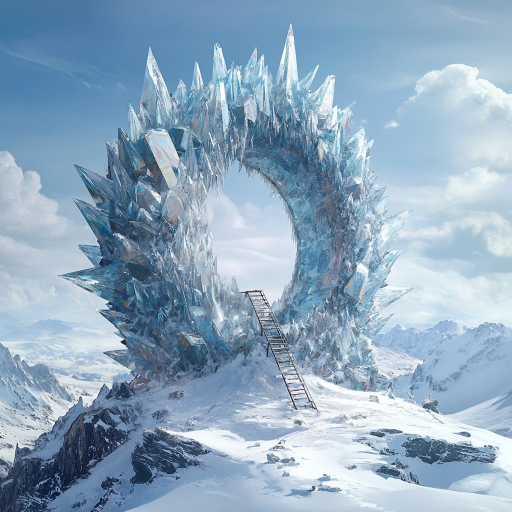

Da dere nærmet dere forsvant han, og en etter en dukket forskjellige spøkelsesaktige skikkelser opp og angrep dere. De var ikke udøde så vidt ekspertene blant dere kunne bedømme, men kanskje noen slags legemliggjorte minner eller bilder.

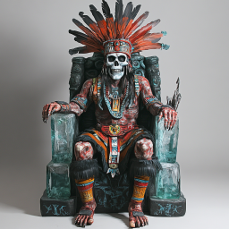

### En goblinoid pirat

Denne skikkelsen lignet på mannen i krystall-boksen som forklarte hvordan man kan vekke de døde til live som udøde.

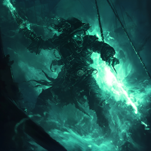

### En brennende mann

Først så han bare ut som et brennende skjelett, men så skapte han et vulkanutbrudd og brente alle som stod i nærheten. Dere tror han kan ha vært vulkanånden som ble fanget i staven.

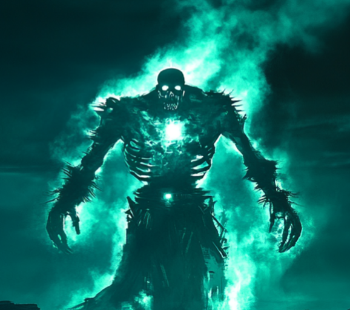

### Frostkvinne

Dette var kvinnen som laget isbreen, men i denne varianten var hun fiendtlig og angrep dere med kulde.

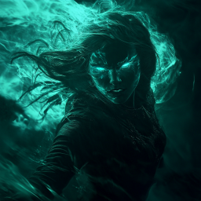

### Angriper fra himmelen

Et digert vesen dukket opp oppe i luften, og svevet litt bortover før han slapp seg ned til bakken og angrep dere.

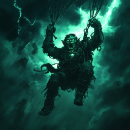

### Leopardmann

Denne figuren lignet litt på leopardmannen som dere kjenner, men han var mer leopard og mindre mann.

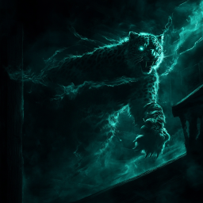

Dere drepte alle sammen, og da ble skikkelsen som satt på tronen synlig. Han var udød, og dere drepte også ham. Dere fant en liten kikkert på ham.

Dere gikk etterpå opp og undersøkte selve krystallsirkelen. Det var tydelig at den var laget for å registrere ting som skjedde i verden, og lagre det i krystallene. Dere så en rekke steder og hendelser, noen gamle og noen nyere:

* En rik sivilisasjon med veier, broer, landsbyer, byer og mye bebyggelse. 
* Flygende skip med mektige våpen (kanoner, store fokuserende speil) som ødelegger denne sivilisasjonen.
* Flere steinspikes.
* Drager, ingen med vinger, men ellers forskjellige i størrelse og oppførsel. Noen av dem slåss mot skipene.
  
Dere kom fram til at krystallene ikke kunne ha stått på dette stedet da de så alt som de har lagret. Etter hvert gikk dere ned igjen gjennom tunnelen.

## Dronningens hoff

Med Tlaca sin hjelp kom dere dere opp til det øverste huset i byen. På veien så dere at på den andre siden av byen var det en del ødeleggelser, det virket som om dragen hadde gravd seg gjennom byen og rasert en rekke hus. Dere klatret vider,e og kom dere inn i et stort rom. Dette var Dronning Nicté sitt hoff! Det var en rekke skikkelser der, noen kjente og andre nye for dere:

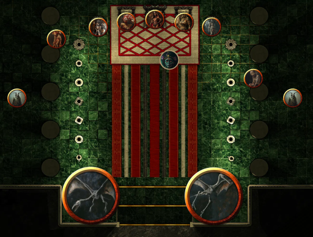

* To bevingede dinosaur-skjeletter
* Den lille damen med malt ansikt som har forsøkt å dra taket ned i hodet på dere noen ganger
* To (levende) geitemenn, som holdt seg i skyggene
* En udød tidligere dronning, med store hengende hudfolder og en ubehagelig kroppslukt 
* En annen udød tidligere dronning, med et vakkert men skremmende utseende
* Den siste dronningen, Chaaca, også hun udød
* Dronning Nicté selv, med kroppen dekket av tatoveringer
* En annen udød tidligere dronning, som nok var ganske vakker da hun levde
* En udød tidligere dronning med rustning laget av noen slags keramiske plater
* En udød tidligere dronning, med et blodig skjelett-ansikt

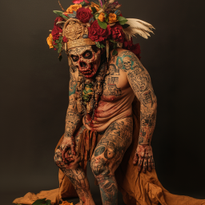
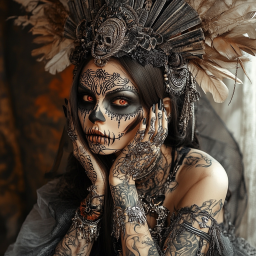
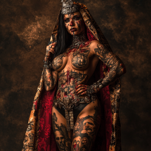
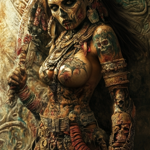
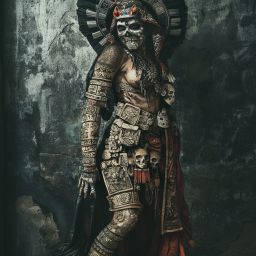
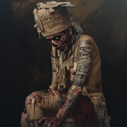

Alle de udøde unntatt Nicté og hjelperen hennes virket å være i en type koma. Dere snakket ganske lenge med Nicté, og fikk bl.a. vite dette:

* Hun lærte kunsten å vekke døde av goblinoiden som hadde etterlatt sitt budskap i krystallboksen. Denne kunsten virker ikke så bra som hun håpte, hun må hele tiden balansere sin egen aktivitet mot sine udøde sin. Hvis de alle skal være aktive, ligger hun i en slags koma. Hun demonstrerte også på noen av dronningene at hun kunne _aktivere_ enkelte udøde i noen sekunder.
* De andre udøde i "hoffet" er Dronning Chaaca og hennes "forgjengere", tidligere dronninger av fjellfolket.
* Nicté trodde at det var spillerne som hadde sendt dragen for å ødelegge byen hennes.
* Hun har lenge jobbet for å være forberedt når de flygende skipene kommer tilbake, men det har skjedd tidligere enn hun hadde trodd, og hun er ikke klar. Hun tenker å rømme lengre ned i undergrunnen.
* Hun har bygget noen kanoner og laget noen bomber som kan bæres av "selvmordskjeletter", men har ingen tro på at dette er nok.
* Hun ville gjerne ha staven som kan binde ånder, men gikk med på at dere kunne bruke den mot skipene. Hun foreslo at frostkvinnen eller en ånd fra et av tannhjulene i sjøen kunne fanges i den.
* Etter at hun ble forvist fra fjellfolket, forsøkte hun å rekruttere mennesker til å bli nekromantikere som henne, men hun ble drept av leopardmannen.
* Hun lovet å hjelpe dere med noen flygende udøde vesener slik at dere kan komme dere inn til nærmeste flygende skipet når det er innenfor rekkevidde. Hun ba dere komme tilbake til de udødes by når dere klare.
* Hun holder på å gå tom for lik som er nyttige å vekke til live, så hun ønsker faktisk at menneskene skal overleve.

Etter å ha forhandlet med dronningen, reiste dere tilbake mot steinspiret og geitemennene.