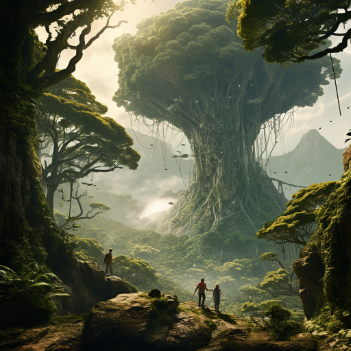

# Tjuefemte spilleomgang: tilbake til røttene

## Tok avskjed med de dødes by

Etter et ganske vellykket møte med den udøde dronningen Nicté, følte dere, klatret dere ned igjen mot inngangen. På vei ned gjennom byen så dere tydeligere sporene av at dragen hadde ødelagt mange hus på sørsiden. Nede i bunn av byen, fulgte dere den underjordiske elven tilbake ned til stedet hvor dere hadde fått løs en stein i "elvetaket".

Tilbake i steinspiret fant dere at sarkofagene lyste kraftig, og da dere alle fire berørte dem, ble dere atter en gang transportert til en svunnen tid.

## Tilbake til K'inich

Dere dukket opp i sarkofagkammeret, men "presterommet" utenfor var forlatt. Et stort horn var satt opp dere, og da dere blåste i det var det flere som kom løpende i tro at det var en alarm. En mann som manglet en fot, fortalte dere hvor alle var - under ledelse av K'inich hadde de reist for å angripe kjempegorillaen i jungelen, ved det enorme treet.

Dere skyndte dere i den retningen, men det tok flere timer før dere kom fram. På vei inn i jungelen så dere flere døde mennesker og fuglemenn, og etterhvert også noen som var i kamp, men dere skyntet dere videre mot jungelens hjerte og kjempetreet. Der møtte dere på noen brutale gorillaer, som dere måtte slåss mot. Etterhvert dukket også den gigantiske kjempegorillaen opp, med K'inich livløs i sin hånd. Kjempegorillaen drepte også Dan, som ble sendt tilbake til nåtiden, men dere andre klarte til slutt å ta livet av ham. K'inich sitt liv stod likevel ikke til å redde.

Omtrent samtidig hørte dere flere horn som blåste igjen og igjen i det fjerne, samme lyd som det dere hadde blåst i øverst i steinspiret, men dette var det ikke så mye dere kunne gjøre med.

Dere fant en sprekk i treet, som ledet inn i dets indre. Dere kom dere inn der, og fant et kammer med diverse verktøy og gjenstander. Det minnet dere (Spesielt Galem) om leopardmannens rom hvor dere først fant krystallsarkofagene. Derfra ble dere trukket ut av fortiden.

## Tilbake til nåtiden

Da dere dukket opp i kammeret på toppen av steinspiret igjen, var noe forandret seg. I sarkofagene lå det lik, skjeletter. Det var ingen ny stein med instruksjoner, og det var ikke noe tegn til lys.

Dere dro tilbake til kjempetreet. Kjempegorillaen var ikke å se lenger, og dere klarte etter hvert å finne igjen sprekken i treet og presse dere inn. Rommet dere hadde sett i fortiden, var nå tydelig preget av tidens tann, men mange av gjenstandene var fortsatt der.

Dere utforsket videre og fant flere rom; først et enkelt soverom, så noen rom som ga inntrykk av å være en slags utstillingsrom. På veggene var det risset inn detaljerte bilder av forskjellige utsikter, mens det i rommet var møbler og forskjellige gjenstander som hadde vært knust eller knukket, men var limt og reparert.

 Deretter fant dere et større rom med en stol og flere krystallvegger. Det virket som om dragen hadde vært der, men det var også et "kikkehull" på den ene veggen.

Dere gikk tilbake til det første rommet dere hadde kommet inn i, og Galem brukte sine krefter til å finne magiske ting. Noe fantes i et naborom, og dere fant en hemmelig dør. Bak døren var et lite rom med en åpen krystallsarkofag. Xavez klatret oppi, dro igjen lokket, og sarkofagen låste seg, og satte Xavez i noe slags stasis! Dere klarte ikke å åpne sarkofagen igjen og spekulerte i om noen nå kunne komme fra fremtiden og ta bolig i hans kropp.

Lengre nede under bakken, i tunneler av tettpakket svart mold, fant dere et kvinneansikt blant røttene til det enorme treet. Galem tok mot til seg og kysset henne, og fikk et syn av han sammen med henne levde i et vakkert hus med nydelig utsikt. Det ble avbrutt da en ung mann kom løpende mens han ropte advarsler.

Deretter forsvant hun inn blant røttene. Dere begynte å gå opp igjen mot overflaten.
