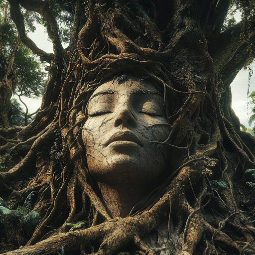
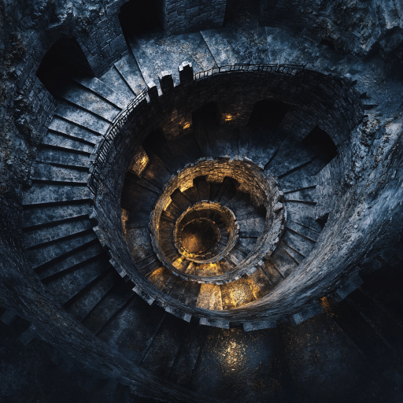
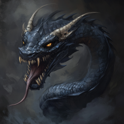
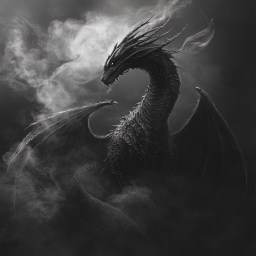
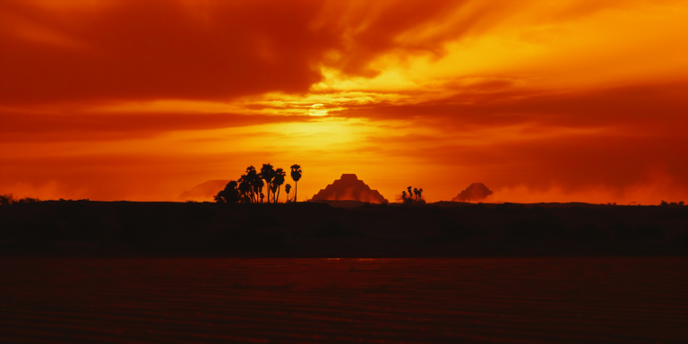

# Åndenes Makt

Etter å ha funnet den merkelige skikkelsen nede blant røttene på kjempetreet, gikk dere opp mot overflaten igjen. På vei ut i sollyset igjen, så dere at det hadde samlet seg dusinvis av gorillaer som satt oppe i greinene.

De virket ikke agressive mot dere, og etter hvert skjønte dere at gorillaenes oppmerksomhet var rettet mot et punkt høyere oppe på stammen. Der dukket kvinneskikkelsen dere hadde vekket i dybet, leopardmannens partner, opp! Hun var blitt vesentlig større, virket det som, og beveget seg uten hinder gjennom greinene og røttene i det store treet.

## Treåndens formaninger

Hun begynte å snakke til dere, og hennes stemme var lav, men fylt med en eldgammel visdom. Hennes ansikt, halvt skjult blant røttene, bar preg av årtuseners erfaring. Hennes trekk minnet litt om leopardmannen, men med en eterisk skjønnhet som gjorde henne tidløs, og uten leopardtrekkene.

> Jeg har sovet lenge... altfor lenge. Men nå kjenner jeg at noe nærmer seg. Noe som vi gamle aldri ønsket å se igjen. Denne verden... vår verden, står igjen på randen av ødeleggelse.

Hennes øyne åpnet seg langsomt, og en svak glød fylte området rundt dere. Dere kjente dufter av blomster og nypløyd mark.

> Jeg er en ånd fra den gamle sivilisasjonen, bundet til dette treet i en dvale som skulle bevare det som var. Men nå, etter så mange år, våkner jeg til en verden i fare. Jeg kan føle det – noe nærmer seg fra himmelen, en trussel som har kommet før og som nå vender tilbake. Min mann skjønte faren og ga sitt liv for å gjøre dere klare.

Hun pekte en rot mot himmelen.

> Disse skipene tilhører Chaneques, vesener fra fjerne stjerner, som har funnet en måte å reise mellom verdener. De søker denne planeten på nytt, drevet av grådighet etter krystaller skapt av den eldgamle dragen, en essens av planetens magi og livskraft. De kommer for å plyndre, og de vil ikke stoppe før alle tegn til liv er borte.

Hennes uttrykk ble alvorlig, nesten sorgfullt.

> Jeg føler en sjel som har blitt adskilt fra sitt kjøtt, fanget mellom liv og død, mellom tider, mellom legemer. Xavez... din kamp er ikke over. Du skal gjenfødes, ikke som den du var, men som en som kan bære denne byrden.

Med en svevende, rituell bevegelse førte hun Xavez sin svevende sjel mot kroppen til en gorilla som stod i nærheten. Dyret skalv et øyeblikk før det rettet seg opp og stirret på dere med en intens, kjent intelligens i øynene.

> Din form er ny, men ditt hjerte er det samme. Du er nå gjenfødt, Xavez, i en kropp som vil gi deg styrke til å møte det som kommer. Men dette er bare begynnelsen.

Hun så på dere med en alvorlig, men håpefull glød i øynene.

> For å stå imot Chaneques og beskytte denne verden, trenger dere mer enn bare deres egen kraft. Dere må vekke flere av åndene som har overlevd fra den gamle sivilisasjonen. De sover dypt, som jeg gjorde, men de kan vekkes og rekrutteres til deres side. Hver av dem bærer en del av den kraften som trengs for å stå imot denne trusselen.

Hun strakk røttene sine dypere ned i jorden, og dere føler en forbindelse til verden under dere.

> Jeg kan føle noen av dem gjennom jorden, gjennom røttene mine. Ay-Etharia, fra løvets skygge, har dere møtt. Han har vandret for lenge i skyggene, snakker ikke lengre vårt språk og har blitt en fremmed for oss. Men hans hjerte er godt.

> Ixkayotl, frostånden, tror jeg også dere har møtt. Hun dekket sin kjærlighet med et teppe av is til hans siste lys var slukket. Dere har staven som hun voktet så lenge.

> Yaku, dypets ånd, var min aller nærmeste, men hun ble revet bort fra sitt hjem. Hun har ødelagt sine lenker, men ikke sitt fengsel. Finn henne på havbunnen, mot nordøst.

> Tzitzimime, ånden for aske og ødeleggelse, sørger fortsatt over sin bror. Hun finnes langt mot vest, i fjellet som var hans hjem.

> Tonatiuh, solens ånd, er nesten utenfor min sansevne, men jeg kjenner såvidt ekkoet fra hans nakne føttes steg i ørkenen mot sørvest.

> Xibalba, underverdenens ånd, er nå den nærmeste. I drømmene har vi hvisket til hverandre, men hans ord bærer en gnist av galskap og desperasjon. Jeg kan åpne veien ned til ham, men ikke beskytte dere.

> Søk disse stedene, og vekk åndene som fortsatt venter. De vil kunne hjelpe dere, men bare hvis dere viser dem respekt.

Hun løftet hånden mot en stor nøtteaktig frukt på en busk.

> Jeg har lite tid igjen i denne formen, men jeg kan binde min essens til denne frukten. Ta meg med dere, og en gang, når tiden er inne, når dere aller mest trenger min hjelp, kan dere vekke meg igjen for en kort stund. Bruk meg med klokskap, og få de andre åndene til å gjøre det samme. Hvis vi står sammen, kan vi kanskje beskytte vår verden mot det kommende mørket.

Med de siste ordene trakk hun seg tilbake i røttene, og hennes essens strømmet inn i frukten. Den begynte å gløde svakt, som om hun hvilte dypt inne i den, klar til å våkne når dere kaller på henne.

## Xibalba, underverdenens ånd

Dere bestemte dere for å begynne med å lete etter Xibalba, siden han var nærmest, selv om treånden hadde advart dere. Dere fant ganske snart at hun hadde trukket noen gamle ruiner opp mot overflaten på en slik måte at de formet en slags improvisert tunnel som dere kunne følge ned i dypet. 

Det var likevel ganske trangt, og dere var bekymret for at Xavez ikke skulle komme seg ned dit med den nye store gorilla-kroppen sin. Men han gravde seg gjennom solid jord i en enorm fart!

Fra tunnelen kom dere ned til et rundt kammer som fortsatte nedover i mørket, med merkelige perspektiver og vinkler som gjorde det umulig å bli helt trygg på opp og ned. Dere satt sjøbein og beveget dere videre. Noen områder lengre nede var tydelig mørklagt på mystisk vis.

En enorm drage dukket opp fra mørket, midt i rommet, men angrep dere ikke, og forsvant tilbake til mørket.

Noen mørke portaler på den ene veggen virket først umulige å komme seg gjennom, men dere skjønte til slutt at dere måtte slukke alle lys for å komme gjennom. Xavez og Ilnan foretrakk å hoppe fra etasje til etasje.

Etter hvert ble dere angrepet av noen fæle skapninger som minnet om digre slanger, men brukte magi til å skade dere. Dere klarte å komme dere videre nedover, og endte til slutt opp helt i bunnen av kammeret, på et gulv av sand.

Dragen dukket opp igjen, og angrep dere med en pust som gikk gjennom marg og bein, men ved å slukke alle lys igjen klarte dere å få den til å slutte å angripe, og den fløy vekk igjen. Dere fant til slutt det dere lette etter, en stor glatt stein som lå begravet i sanden, og tydelig bar på en mektig kraft. Da dere tok den, lettet mørket, og dere kom dere opp i dagen igjen så fort dere kunne.

Oppe i lyset så dere at den mørke steinen så ut til å ta skade av sollys, så dere pakket den fort inn.

## Tonatiuh, solens ånd

Deretter bestemte dere for å reise mot sørvest, ut i ørkenen. Der ville dere se etter solens ånd. Det var ingen enkel tur, men ved å klatre opp i toppen av det største treet, fant dere en rute, og etter noen dager med strabaser, fant dere en pyramide ute i sanden.

På vei nærmere, ble dere angrepet av en flokk med kjempebiller. Dere hadde akkurat overvunnet dem, da noen skikkelser dukket opp i pyramidens inngang!

