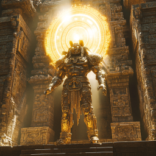
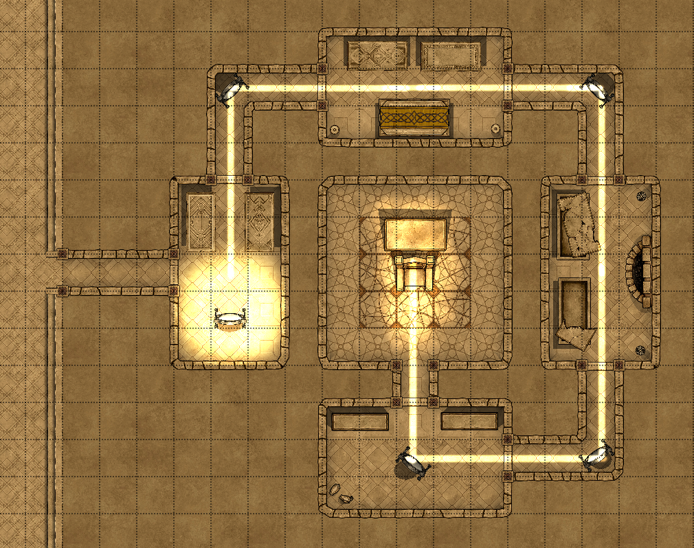
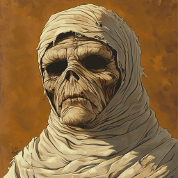
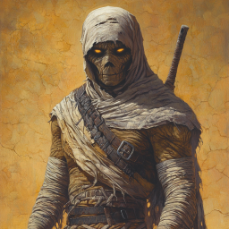
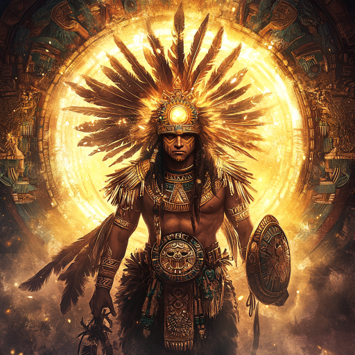
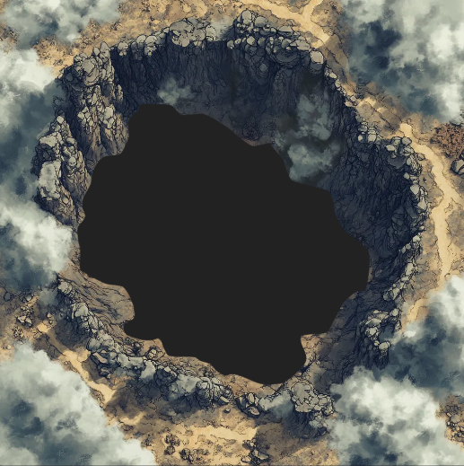

# Tjuesyvende spilleomgang: Fy farao

Dere var ute i ørkenen, og hadde akkurat overvunnet noen store biller. Plutselig føltes det som om solen spant over himmelen, og med ett stod det en mektig skikkelse i inngangen til pyramiden. 

Dere fortalte ham om oppdraget dere var på, og at Kakawa hadde sendt dere. Etter en kort samtale forsvant han, og dere kunne gå inn inngangen. Der fant dere en dør med noen solur på, og et symbol. Etter litt knoting skjønte dere at dere med litt kraft kunne snu på dem, og etter at dere først hadde satt dem til vinterjevndøgn og deretter sommerjevndøgn, åpnet døren seg, og dere kom inn i selve pyramiden.

I det først rommet kom det sol ned fra taket, som ble reflektert i et speil. Det var også to sarkofager. Dere oppdaget at det var mumier i dem, som angrep dere. Den ene var en svekling, Ilnan holdt den først innesperret. Den andre var litt tøffere, men også den falt for deres samlede kraft. 

 

Dere justerte litt på speilet, slik at det traff et avmerket felt på døren, og den åpnet seg. I hjørnet var det nytt speil, som også måtte justeres. Neste rom hadde en liten vekt med noen lodd med soler og måner på. Dere begynte å forsøke å løse gåten, da noen små flygende vesener kom ut av veggen, ett i det først rommet og ett i det andre rommet. De pustet ild, men dere tok dem ganske raskt.

Deretter skjønte dere at loddene representerte solens og månens syklus, og dere plasserte dem på vektskålene i korrekte proporsjoner. Døren videre åpnet seg, og dere kom til neste rom. Der var det noen knuste, og tomme sarkofager. Dere fant en scroll, med et magisk formular for å lage lys.

Døren videre hadde et støvete speil. Dere tørket av det, og begynte å se scener fra deres fortid. Dan så da han overtalte Xavez til å legge seg i krystall-sarkofagen, Galem så da han kranglet med sin kone rett før han skulle dra til sjøs. Dere skjønte etterhvert at dere måtte vise anger for å komme gjennom døren. Om den var oppriktig, var kanskje ikke så viktig.

I neste rom var det et par benker, og en tunnel inn mot midten. Det dukket opp en flygende ildskapning fra veggen igjen, og lysstrålen forsvant. Dere måtte slåss med den som dukket opp hos dere, samtidig som Ilnan løp tilbake mot det først rommet. Heldigvis var han kjapp på foten, og kom seg helt tilbake før dørene lukket seg. Xavez forsøkte å hjelpe til, men de smale gangene var ikke laget for gorillaer.

Endelig hadde dere tatt flygedyrene, og fikk åpnet døren inn til det sentrale kammeret i pyramiden. Der var det en trone og en sarkofag. Lyset fra speilene ble kraftigere og kraftigere, og plutselig dukket Tonatiuh opp, i et hav av sollys.

Han snakket til dere med en rungende stemme.

> Dere som har våget gjennom mine prøvelser og stått i solens brennende lys, trå frem og gjør deres hensikt kjent. Hva søker dere her i mitt hellige tempel?

Dere fortalte at dere søkte hjelp fra åndene for å møte trusselen fra Chaneques, de flygende skipene.

> Jeg kjenner til stjernenes bevegelser og har merket uro på himmelen. Men hvorfor skulle jeg, Solens ånd, blande meg inn i menneskenes anliggender? Hva får dere til å tro at dere er verdige min hjelp?

Dere fortalte at dere hadde gått gjennom hans tester og møtt utfordringene med stort mot.

> Mot, visdom og renhet er dyder jeg verdsetter høyt. Men fortell meg, hva vil dere gjøre med den makten jeg kan gi dere? Vil dere bruke den klokt, eller vil dere la stolthet og maktbegjær styre deres handlinger?

Dere lovet å bruke den klokt.

> Mange har kommet før dere, og ikke alle har hatt edle hensikter. Hvordan kan jeg vite at deres ord er sannferdige?

Dere lovet igjen å bruke kreftene klokt.

> En ed avlagt under solens fulle kraft bør man ikke ta lett på. Sverger dere, her og nå, å bruke min gave til å beskytte og bevare balansen i verden, og aldri misbruke den til egoistiske formål?

Dere sverget alle det.

> Da aksepterer jeg deres ed. Motta min velsignelse, Solens stråle, som vil styrke dere i møte med mørket. Bruk den klokt, og husk alltid at lyset må balanseres med rettferdighet og ydmykhet. Før dere drar, vit at reisen deres ikke ender her. Det finnes andre ånder som må vekkes. Søk deres visdom og styrke. Sammen kan dere kanskje forhindre den kommende katastrofen.

Han forsvant, og dere oppdaget at dere hver hadde fått en stor medaljon med solstråler på. Dere skjønner at dere kan bruke dem en gang, enten hver for seg eller samlet. Jo flere som brukes sammen, jo større blir effekten.

Deretter forlot dere pyramiden, og dro videre mot nordvest for å finne Tzitzimime, ånden for røyk og aske. Der sørger hun over sin bror, i fjellet som var hans hjem. Dere fant fjellet, klatret opp på kanten og så ned på en stor caldera, mørklagt av røyk.

