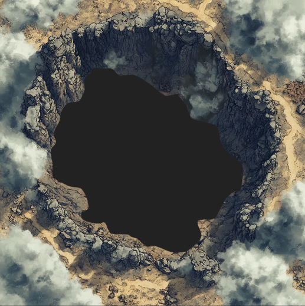

# Tjueåttende spillomgang: Jenten i røyken

På vei fra pyramiden, studerte Galem lysene på himmelen. Han anslo at de ville være framme hos dere mellom dag 158 og 163.

## Dag 140

Dere stod ved randen av den store calderaen hvor Kakaw sa dere kunne finne Tzitzimime, ånden for aske og ødeleggelse. Bunnen var dekket av røyk, og det var umulig å se bakken der nede. Likevel kom dere dere nedover skråningen og begynte å utforske. Dan brukte lyset fra Stifinneren til å lyse opp et lite område rundt dere, men røyken var så tett at dere så bare noen få meter.

Dere fortsatte inn gjennom røyken, og ble angrepet av to digre magma-krabber og en flammevandrer. Flammevandreren klarte dere å ta knekken på, men magmakrabbene var formidable fiender, og den ene ga gorillaen Xavez et dødelig sår. Dan forsøkte med rask intervensjon å hjelpe ham tilbake til livet, men denne gangen gjorde han mer skade enn nytte, og Xavez sin historie sluttet der, i asken.

 

Dere hørte kontinuerlig stemmer inne fra røyken, og en av dem dukket opp; en kvinneskikkelse som mest bestod av røyk, men som snakket med dere:

> Hvorfor trår dere på disse forlatte landområdene, dødelige? Vend om, for intet annet enn sorg og død venter dere her.

Dere forsøkte å holde motet oppe, men ble mer og mer nedslåtte og triste av å være i nærheten av henne. 

> Jeg føler tvilen som lurer i deres hjerter. Frykten dere skjuler selv for dere selv.  

Heldigvis klarte Dan å løfte litt av tungsinnet deres med noen betimelige tips om mental egenpleie. Da virket det som forbannelsen var brutt.

> Deres besluttsomhet er... uventet. Kanskje det finnes en gnist av håp i dere likevel. Men er dere villige til å konfrontere de dypeste skyggene i deres sjeler for å møte Tzitzimime? Hun hviler i hjertet av dette ødelandet. Gå frem, og la deres håp forbli ubrutt. Men vær på vakt—hennes sorg er dyp, og kun de som kan tenne en gnist av håp bør gå til henne.

Den digre gorillakroppen klarte dere ikke å dra med dere, så tunge til sinns lette dere videre etter Tzitzimime. Dere fant henne i midten, ved noe som først så ut som et lite vann. Raskt skjønte dere at det var et slags hull fylt av en tung og illeluktende gass.

Hun gikk med en svart lærmaske som så ut til å dekke over omfattende brannsår.

> Hvem våger å trenge inn i mitt domene, i dette landets hjertesorg?

Dere fortalte hvem dere var, og at Kakaw hadde sendt dere. Hun virket ikke så entusiastisk.

> Verden er allerede dømt. Se rundt dere—liv blir til aske, håp blir til ingenting. Hva kan dere, dødelige, gjøre mot slik uunngåelighet?

Dere forsøkte å argumentere for at det var et håp, men at dere trengte alle de gamle åndenes hjelp.

> Så, dere ønsker å utnytte min kraft? For å kjempe en kamp som allerede er tapt? Hvorfor skulle jeg bry meg om denne verden som har glemt både meg og min bror?

Så oppdaget hun at Dan bar på staven som hadde fanget hennes bror for så lenge siden.

> Bærer du min brors fengsel? Var deres plan å fange meg, slik han ble fanget, og pine meg slik han ble pinet?

Dere var raske med å forklare at dette ikke var deres intensjon.

> Minnet om den siste glo fra den siste flamme han pustet liv i, finnes fortsatt i den staven. Hans lys har vært mørke, hans varme har vært kulde. Knekk staven, slipp i det minste fri minnet om hans fangenskap.

Dan knakk staven, og fra de to jernringene kom det en gnist som tente det oppsplittede treverket og vekket en liten flamme. Dere kastet flammen i gassen, som øyeblikkelig tok fyr. Dere hørte at flammene spredde seg utover under bakken, og en tydelig buldring vokste i styrke. Tzitzimime var borte, og dere løp alt dere maktet mot kanten på calderaen. Der oppe møtte dere henne igjen.

> Jeg vil låne dere min kraft. Men husk, ødeleggelse er en del av syklusen. Bruk den klokt, for fra ødeleggelse kan også gjenfødsel springe. Hvem vil bære meg?

Ilnan meldte seg frivillig, og hun ble da til en røyksky som tok bolig i ham. Han hostet og harket, og med hvert pust kunne dere se røyk, som kom ut men så forsvant ned i lungene hans igjen.

Deretter dro dere avgårde mot isbreen og isånden Ixkayotl, men det var vanskelig å ikke tenke på deres følgevenn. Hans kropp ligger i en krystallsarkofag under det største treet i skogen, mens hans sjel sist ble sett i en gorilla som nå har blitt slukt av en vulkan!

