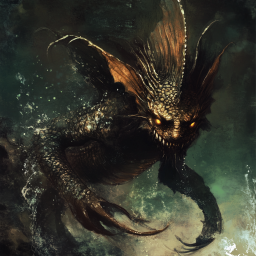
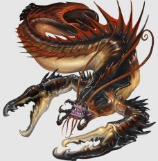

# Frozen, not stirred

## Dag 141

Dere forlot calderaen med en litt dårlig følelse, etter å ha etterlatt gorilla-liket til Xavez i ildhavet. Men dere hadde i alle fall fått med dere noe fra Tzitzimime; røyken som fantes i Ilnan sine lunger!

Dere hadde en overnatting der ørkenen sluttet og det ble litt grønnere, og deretter en overnatting i det lille skuret ved isbreen. Det var tydelig for dere at noen hadde vært i skuret siden dere var der sist; i sengen fant dere også noen geitehår. 

## Dag 142 

Dere kom opp til det lille tjernet som noen av dere (Galem og Xavez) tidligere hadde besøkt og drømt om frostånden. Dere så ned på isbreen, som tydelig var i ferd med å smelte. Fra det lille tjernet var det en liten bekk som rant ned mot breen. Dere så dere litt rundt uten å se tegn til frostånden, men så ropte sorg-ånden fra calderaen hennes navn med Ilnan sin stemme: 

> <h1 style="color:lightblue">Ixkayotl!</h1>

Da begynte temperaturen å synke raskt i området, tjernet frøs til is, og bakken sprakk opp i store sprekker med iskrystaller. Dere ble helt slått ut av den plutselige temperaturovergangen.

Bakken åpnet seg, og dere kunne gå ned i et stort kammer, men iskald luft. Det var nesten som en slags katedral, bare noen meter under bakken. I den innerste veggen kunne dere se en stor skikkelse inne i permafrosten, det var froståndens kropp, kroket sammen i fosterstilling og dekket av klar is. Ilnan ble igjen tvunget til å rope hennes navn:

> <h1 style="color:lightblue">Ixkayotl!</h1>

Hun begynte å bevege seg. Isen knuste og føk gjennom rommet. Dere fortalte henne litt om hva som hadde skjedd med staven og vulkanånden. Hun virket først motvillig, men gikk så med på å hjelpe dere. Hun åpnet seg opp og dere kunne se at hun hadde holdt armene rundt en nedfrosset mann, i en forseggjort slags uniform med fjærpryd og smykker. Hun la ham forsiktig på bakken og trakk seg inn i veggen igjen. Dere tok ham med ut av hulen, og etter hvert begynte solen å tine ham opp. Dan behandlet også frostskadene hans.

Når han ble bevisst, snakket han til dere på det gamle språket, og fortalte at hans navn var Oxmal. Han hadde blitt forrådt i sammenheng med et av de tidligere angrep av de flyvende skipene, og frostånden, som den gang var et menneske og hans elev, hadde frosset ham ned og reddet hans liv. Dere fortalte ham litt om hva som foregikk, men han virket fortsatt forvirret.

Dere tok ham med ned til steinspiret, fikk snakket med de andre sjøfolkene, fortalt om hva som hadde skjedd med Xavez, og vist Oxmal rundt i spiret.

Navigatøren som følger med på lysene på himmelen ga dere sitt siste oppdaterte anslag på når de kommer fram til dere; det første dag 160 og de andre dag 161 eller 162.

## Dag 143

Dagen etter dro dere til sjøen for å finne den siste ånden, og fant et knust stormhjul. Oxmals magi hjalp dere i vannet, men de to sjødjevlene dere møtte, og krabbeslangene, var likevel en ordentlig tøff motstand. Krabbeslangene klarte dere å ta, men det kom også to haier, antagelig tilkalt av sjødjevlene! Dere karret dere hardt skadet opp på revet for å komme dere unna haiene, i alle fall. 

 