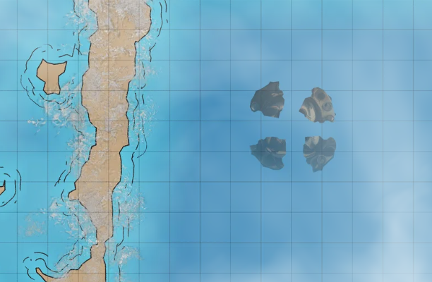

# Operasjon Rent Hav

## Dag 143

Dere kom dere på land og fikk samlet tankene, kreftene og helbredet hverandre etter en hard første kamp mot sjødjevlene og haiene deres. 

## Dag 144

Neste morgen var Galem ikke i form. Han hadde fått en blodforgiftning av rustbillene i ørkenen som nå slo ut. Likevel tok dere opp kampen igjen, og klarte å ta en sjødjevel og drive den andre på flukt. På havbunnen lå det ødelagte tannhjulet. Dere forsøkte å dra det på land, men det var av massiv stein og voldsomt tungt. Etter å ha forsøkt mange forskjellige metoder for å frigjøre Yaku, klarte dere å finne ut at symbolene på hjulet minnet om Ay-Etharia sitt familie-symbol, de to jernringene i kryss. Dere gikk tilbake til steinspiret, og fikk kontakt med ham. Han hadde sammen med Clarke bygget en ballista og en tilhørende bolt, av kjernen fra det største treet i skogen.

Dere laget en parasoll av palmeblader, slik at han kunne bli med helt ned til sjøen. Der falt han inn i sine egne tanker, men etter en stund hoppet han i sjøen og svømte ned mot tannhjulet. Kroppen hans ble gradvis brutt opp av sollyset som trengte seg ned gjennom vannet, men det virket som han klarte å gjøre det han ønsket, for et kraftig rop kunne høres, og en skygge skjøt gjennom luften mot sørvest. Clarke var trist over tappet av sin åndevenn, men Oxmal følte at hans søster Yaku endelig var fri. Nå var det bare å finne henne.

Dere gikk mot sørvest, forbi ogrenes gamle hus, og inn i skogen. Til slutt fant dere en _cenote_, et stort hull i bakken inne i skogen fylt av vann. Det virket som det var ruiner av byggverk inne i veggene, men vannet var fullt av illeluktende grønn gugge.

