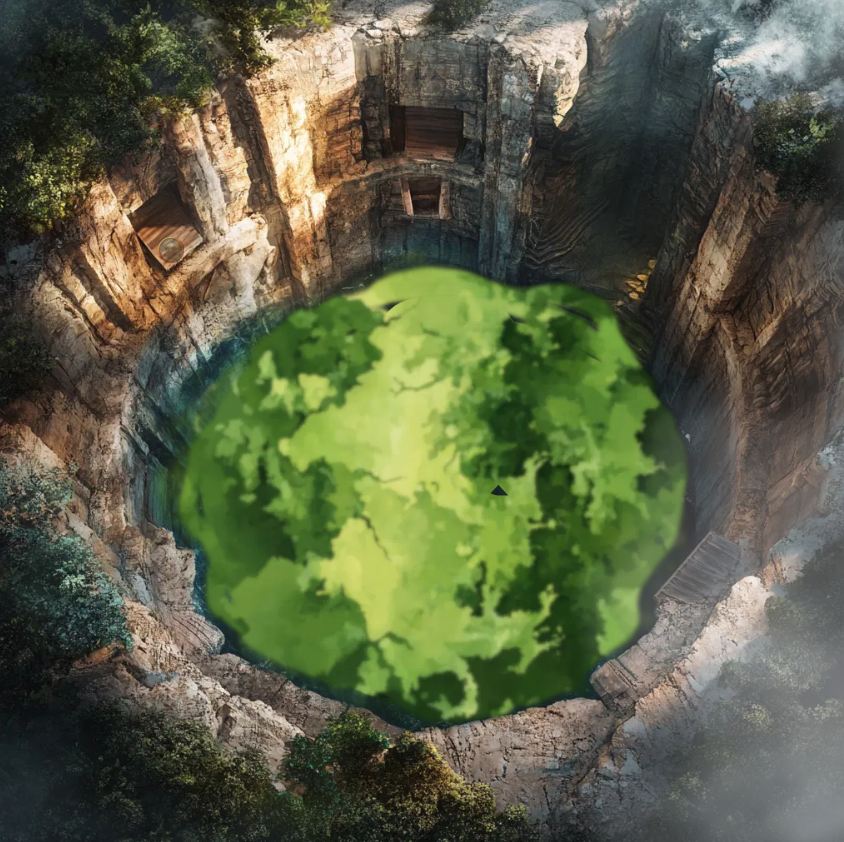
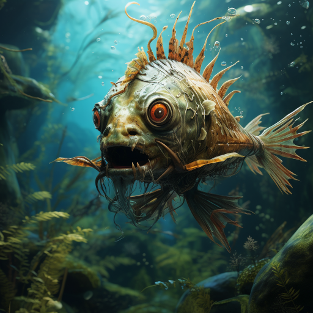
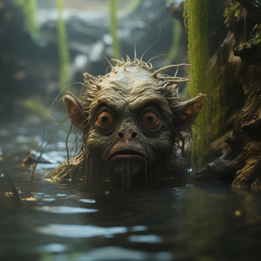
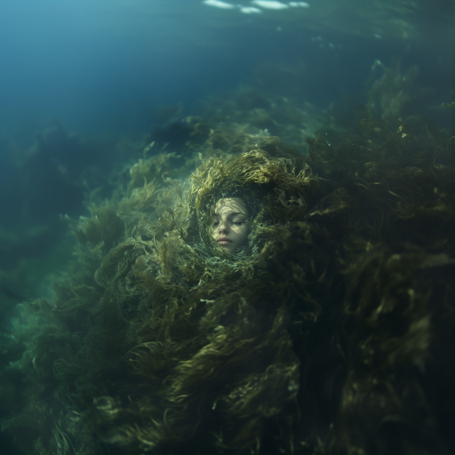
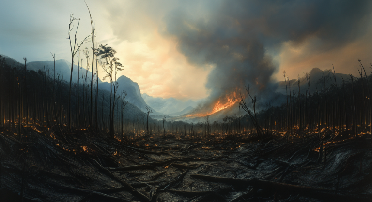

# Apokalypse nå?

## Fisketur

Dere utforsket cenoten inne i jungelen med det grønskefylte vannet. Det var mulig å ganske enkelt klatre ned slik at dere kom litt nærmere på. Dere var kommet rundt til den motsatte veggen, da en slimete greling hoppet fram og sprutet klissete gugge på noen av dere, som gjorde det vanskelig å bevege seg. 

Dere begynte kampen mot ham, etterhvert kom det også noen store fisker nede i det skitne vannet. De hoppet høyt opp og bet dere, så dere skjønte dere måtte bare komme dere ned i vannkanten og bekjempe dem der. De gjorde ikke så mye skade med selve bittet, men giften kunne paralysere dere. 

 

Til slutt tok dere dem, men Yaku var ikke noe sted å se, så dere kom dere litt vekk og slo leir inn i skogen. 

## Gjenforeninger

En time senere hørte Uxmal stemmen til sin søster, og dere gikk tilbake til cenoten. Der var vannet blitt nesten helt klart, og dere kunne se at Yaku lå på bunn, innfavnet av en slags sjøgress. Uxmal svømte ned til henne, og klarte å vekke henne. 

Hun uttrykte sin takknemlighet for at dere først hadde hjulpet henne å komme fri fra steinhjulet i sjøen, og deretter bekjempet gremlingene som hadde overtatt vannhullet hennes. Hun var også veldig glad for å se igjen Oxmal:

> Uxmal... Min kjære bror, du lever? Ixkayotl påstod at du ville komme tilbake en gang, men jeg visste ikke om jeg kunne stole på henne. Hvis vesenene fra stjernene vender tilbake, må vi stå samlet. Jeg vil hjelpe dere.

Men lykken ble avbrutt av at dere la merke til en fjern plystrelyd. Dere så opp på kveldshimmelen, og så mange striper av lys som kom ned mot bakken. Etterhvert hørte dere også en dump eksplosjon i det fjerne, og et halvt minutt senere ristet bakken under dere.

 Dere hørte også at noen kom løpende gjennom jungelen. Snart så alle at det var Xavez, som kom løpende mens han bar på en stor stein! Han ropte, litt gebrokkent:

> Ned onder vannet! 

Selv stupte han ned i vannet, og dere gjorde ganske snart det samme. Omtrent så snart dere var under vann, hørte dere at plystringen ble kraftigere, og et øyeblikk senere kjente dere en en massiv eksplosjon. Gjennom vannet kunne dere se at trær ble slengt avgårde av enorme krefter, en del greiner havnet også i vannet hos dere. Selv ble dere slengt omkring, og det var umulig å skille opp og ned, men det virket som Yaku brukte vannet til å beskytte dere noe.

Litt senere ble selve bakken rundt cenoten revet opp og svære sprekker dukket opp på alle sider. En bølge av ild skylte også gjennom skogen, og vannoverflaten kokte. Selv inne i den store vannmassen følte dere at dere ble kokt. 

## Ut i krigssonen (dag 144)

Dere kom dere ut av vannet, og Xavez ropte til dere at dere hadde dårligere og dårligere tid. Han sa også noe om at dette kanskje var siste sjanse, og at det var mange ting dere måtte gjøre.

Før dere dro, løftet en tydelig skadet Yaku hånden, og fra vannet steg en krystallklar kule som pulserte med en myk blå glød.

> Denne vannkulen inneholder en del av min essens. Den vil beskytte dere mot fiendens illusjoner og gi klarhet når alt virker tåkete.

