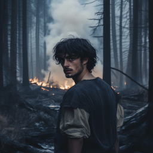
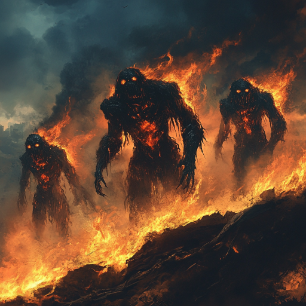
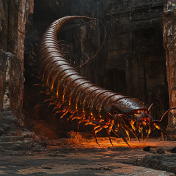
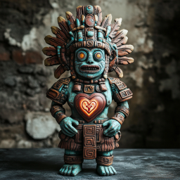
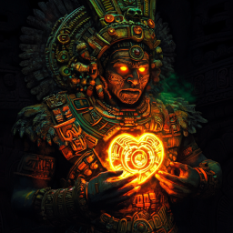

# Ned i hølet, vondt i hjerteroten

Dere fikk snakket litt med mannen i Xavez sin kropp. Han fortalte at han egentlig het Victor, og kom fra fremtiden. I ganske rask rekkefølge, og med lite rom for kommentarer, fortalte han også:

1. Han er egentlig halvt menneske og halvt geitemann, i likhet med de andre i hans stamme. Han tror at Veronica Farrow er hans stammor.
2. Folket hans lever mest under bakken, i skjul, og har forberedt seg på denne kampen hele livet, i mange generasjoner. Folkene fra de flygende skipene forfølger dem fortsatt, bl.a. med underjordiske gremlinger.
3. Han har ikke en detaljert historie for sitt folk, og vet heller ikke nøyaktig hvor langt inn i fremtiden han kommer fra.
4. Folket hans fant krystall-sarkofagen med Xavez sin kropp og skjulte den dypt under bakken. Victor har reist tilbake i tid mange ganger, andre har også forsøkt, men Victor har klart seg best. Han frykter at dette er siste forsøk, siden tiden "slipper" litt hver gang han forsøker.
5. De udøde finnes fortsatt i framtiden, men ikke Nicté. Den udøde kvinnen med malt ansikt leder dem, og de holder stort sett fred med geite-menneskene.
6. Victor er trent som en mystiker, som kanaliserer energien til noen spesifikke ånder som ikke har en kroppslig tilstedeværelse. Hans "magi" krever ofre, fortalte han.

Han sa at han ville dra til steinspiret for å forberede geitemennene til å forsvare det. I mellomtiden ba han dere skaffe hjertet til en ildånd, fra et gammelt underjordisk tempel som eksplosjonene hadde avdekket. 

Deretter dro han mot steinspiret, og dere mot det nærmeste krateret. Der fant dere et slags tårn av tungsten, og tre tungsten-golemer som dere måtte nedkjempe. Ilnan slengte dem omkring som filledukker. 

Nærmere undersøkelser av "tårnet" viste at de antagelig var et prosjektil som hadde truffet bakken med voldsom kraft. Tungsten-golemene hadde vært inne i tårnet, det var også mange andre der. Noen av dem var digre, men det virket som de fleste hadde blitt drept da prosjektilet traff bakken.

Så kravlet dere ned i fjellet gjennom en sprekk, og fant et gammelt ild-tempel. Dere drepte en tusenbein, og kom dere inn til selve ildånden ved å ta en rap/scat basert på noen gamle noter på døren, som Uxmal klarte å lese. 

Først var det bare en liten figurin der, men Niim kom på navnet hans. Det var forræderen som hadde skadet Uxmal så hardt i oldtiden. Dere drepte ham og tok hjertet hans. Det var en dør til der, men låsen var komplisert og dere klarte ikke å få den opp.

