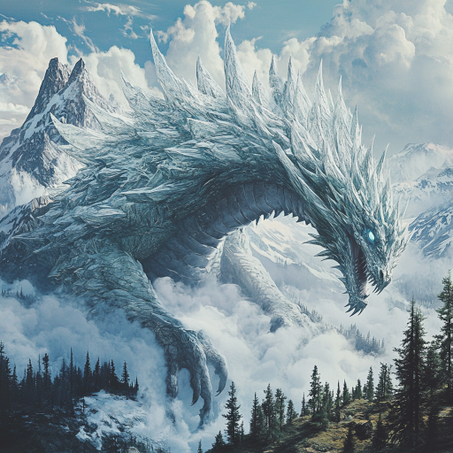

## Dan blir dødens herre

### Dag 145

Dere våknet i Uxmal sin mystiske hytte. Så åpnet den vanskelige låsen i ildtempelet, og plyndret skatterommet. Det var en rekke skatter der, som dere fordelt mellom dere. 

Galem laget to fuglemann-hansker for Ilnan, med symbolet fra fuglemann-figuren dere fant i gravkammeret for lenge siden.

Så gikk dere innom spiret. Sjøfolkene, en geitedame og Tlaca slåss mot noen tungsten golemer på første etasje. Dere hjalp til, tok dem, og helbredet de skadede.

Victor stod i toppen av spiret og laget en beskyttelse mot "kometene" ved å tappe livskraft fra geitemennene. Etter at en ny runde med kometer var ferdig, var de fleste geitemennene døde eller bevisstløse. Dere dro nordover for å få tak i flygende udøde.

På veien så dere at dragen kom ut av fjellene (bokstavelig talt) og laget et spor av krystall sørover.

Det var sakte å gå, så dere måtte overnatte ute i asken. Det gikk en patrulje av tungsten-golemer forbi på natten.

### Dag 146

Dan testet en hjelm som han fant i skattekammeret, han ble da veldig kald. Han spekulerte i om det kunne hjelpe mot ild.

Dere hentet de udøde. Nicté hadde bare to, men ved å få dem til å spise flygehanskene til Ilnan, lærte hun også Karan og Gerkin å fly! Dan tenkte tilbake på teknikkene han hadde studert i den mystiske boksen i de udødes by, og etablerte kontroll over alle de fire udøde.

På kvelden gikk dere tilbake mot spiret. Dragen lå rundt spiret og jafset etter dere når dere fløy forbi mot "balkongen" på toppen.

