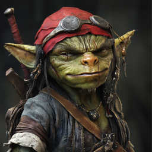

# Stjernekrig

## Dag 147

Dere våknet ganske tidlig i spiret. På natten hadde det vært relativt stille, men dere merket raskt at dragen fortsatt lå slynget omkring basen på spiret. På vei opp mot toppen, møtte dere seilmakeren, som hadde sydd noen store ponchoer til dere som skulle skjule dere på vei opp mot trusselen fra stjernene. De var farget mørkt for å gå i ett med all asken på bakken. 

Victor satt og sov oppe i krystallrommet på toppen. Dere så at den store krystallen fortsatt brant, og nå hadde blitt ganske varm og nærmest litt mer gjennomsiktig. Galem klarte å skimte et perlemor-farget egg der inne, og da Victor våknet fortalte han at det var det han holdt på med, å få egget til å klekke. Han pekte ut en omtrentlig retning på himmelen, og dere fløy avgårde på de fire skjelettene, med kamuflasje-ponchoene på dere.

Victor poengterte at dere ikke måtte komme tilbake før dere var sikker på at trusselen var avverget; forrige gang han forsøkte hadde eventyrerne feilet ved at de dro tilbake for tidlig.

Dere fløy i mange timer opp over havet, og til slutt klarte dere ved hjelp av en kikkert å få øye på fiendene. Det var først ett lite lys, deretter et større lys, og langt bak det en klynge med andre lys. Dere siktet mot det nærmeste lyset, og kom dere innpå en merkelig farkost.

Dere landet bak på taket, og klarte å snike dere innpå de to grønne skapningene der. De var tøffere enn de så ut, men Ilnan kastet den første ganske enkel overbord. Skrikene hans skapte litt oppmerksomhet, så det kom flere, og også en diger skapning, som en mellomting mellom ogrene som bodde i steinhuset, og den fæle frostskapningen som dere måtte bygge et bål på isbreen for endelig å få drept.

Det var enklere denne gangen, for selv om man skulle tro det var umulig tok Ilnan tak i vesenet, dobbelt så høy og sikkert seks ganger så tung som ham selv, og kastet ham også over bord. Tre-fire andre av de små grønne tok dere også ganske raskt knekken på.

Dere kom dere ned gjennom den åpningene de hadde kommet opp av, og fant ut det var konstruert og innredet omtrent som skipene dere var kjent med. Dere gikk omkring, og fant en del soverom (både for små og store skapninger) og et rom med mange forskjellige kart, inkludert ett av verden slik den var da Uxmal levde.

Dere fant også ut at folk ombord snakket gjennom noen rør. Uxmal brukte magi for å forstå hva de sa.

Dere klatret ned en stige til, og fant en låst dør med to låser. Dan klarte å åpne den, men bak var det bare noen verktøy og en ny låst dør med to nye låser. Dan klarte den ene, men noe gikk kalt på den andre, og hele døren kilte seg fast og ble umulig å åpne. 

Dere gikk videre og fant et slags kontrollrom. Der var det en rekke skapninger; flere av de små grønne, inkludert noe som så ut som en slags kaptein, og et digert grønt vesen likt det som Ilnan kastet over bord. Men denne hadde på seg en mektig rustning og bar en diger øks!

Det ble en lang og hard kamp! Særlig det store vesenet helbredet seg selv så lenge han ikke ble angrepet med ild, og både Uxmal og Dan ble slått ned. Til slutt klarte dere likevel å ta alle, den siste grønne fyren overga seg til slutt. 