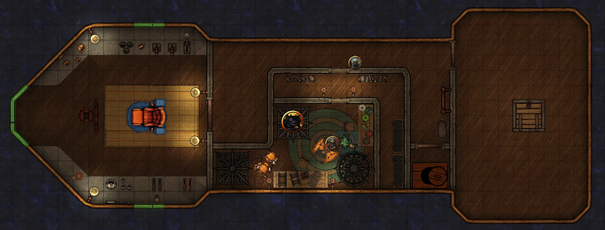
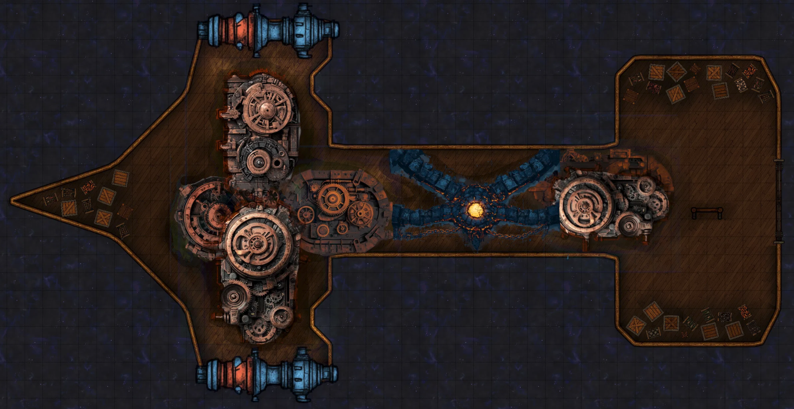

# Open the pod bay doors

## Dag 147

Dere hadde akkurat sikret fangen, da det kom noe prat fra tronen. Det viste seg at det også der var noen rør som man kunne snakke gjennom. Det virket som det var minst tre personer som snakket. Oxmal brukte magi for å skjønne hva de sa. To var nede i maskinrommet, og så var det han som var innesperret bak den solide døren etter den mislykke dirkingen.

Oxmal klarte å lure de to fra maskinrommet til å komme opp på broen. De var noen tøffinger, og hadde rør med lyn på som de slo dere med, men til slutt klarte dere å ta dem. Dere tok med dere ett av rørene for å forsøke å lære å bruke det.

Deretter gikk noen av dere tilbake til den låste døren, skjønte at det var en tidslås, og klarte etter hvert å åpne den. Der inne var den en gærn goblin, flere gremlins, og forskjellige typer vitenskapelige gjenstander. Dere slåss med ham en stund, og døren ble også lukket igjen. Til slutt endte det med at han laget noe slags giftsky der inne som også strømmet ut i gangen.

Samtidig var andre nede i maskinrommet, hvor dere oppdaget at det var en ånd som var fanget og som var knyttet til skipets framdrift på en eller annen måte. Dere fikk mental kontakt med den, og fikk inntrykk av at det var ånden av en slags stor drøvtygger. Oxmal og Galem demonterte maskinen slik at den slapp ut, som en gjennomsiktig skikkelse som vokste seg støre og større, 
men da bikket hele skipet over og begynte å falle fritt! Dere kom dere akkurat ut av de store dørene bak på skipet med skjelettene deres, og fløy videre mot hovedskipet. Dere kunne se lyset fra det et stykke unna.

