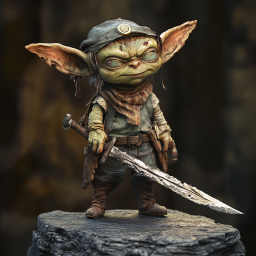
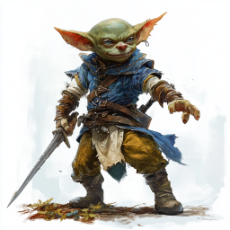
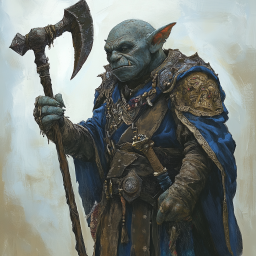
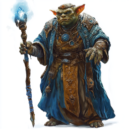
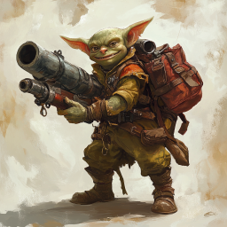
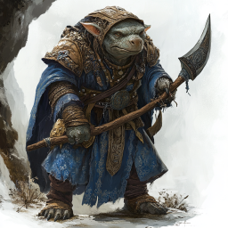
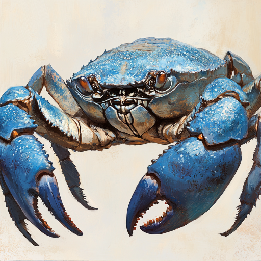

# Fra skip til skip i nattehimmelen

Dere kom dere videre fra det fallende skipet til et annet som lignet, men var litt annerledes konstruet. Det var dekorert med en masse krabbeskjell som var malt i forskjellige blåfarger.

 Dere slåss dere nedover fra dekket. I den øverste etasjen møtte dere en goblinprest med en spesiell sigd som reflekterte månelys. Dere drepte ham, det siste han ropte var "Basalfeyst!". Etterpå fant dere forskjellige "skatter" under et alter, og en masse små glassbiter. 

 Gjennom glassbitene var det en skikkelse som stirret på dere. Hun virket som hun var halvt goblin og halvt ulv.

Det var også et lite håndarbeidsrom i den etasjen.

Dere gikk ned en stige, og møtte på en gjeng med forskjellige goblins, i tillegg til en kjempekrabbe. En goblin kom ut fra en dør, med et digert skytevåpen, men han traff dere ikke.

