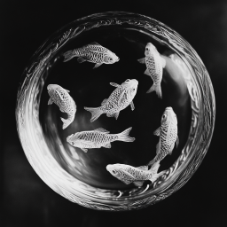
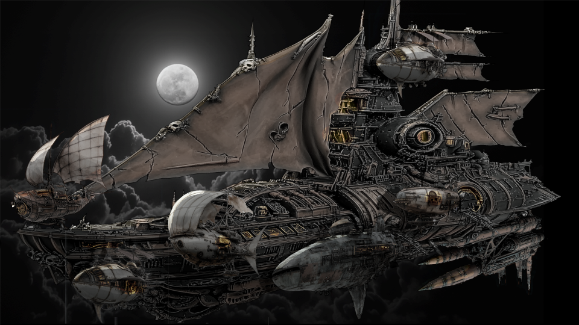

# Inn i flaggskipet

## Ut av tempelet

Dere utforsket videre etter å ha overvunnet kjempekrabben og goblin-prestene. Dere fant et toalett, og utforsket også broen på dette skipet. Der var det en rekke forskjellige instrumenter, og etter litt eksperimentering klarte dere å styre både retning og høyde. 

På det laveste dekket i skipet fant dere også en ånd som var fanget i en glasskule. Den var gravert med bilder av små fisker. 

Dere så i kikkerten på dekket at de andre "småskipene" styrte mot det store moderskipet. Dere gjorde det samme, men i lavere hastighet, slik at dere fikk tid til å ta en lengre hvil.

## Dag 148

 Da dere nærmet dere, så dere at de andre småskipene hadde forankret til moderskipet. Dere nærmet dere på samme måte, men da dere var kommet helt inntil, ødela dere glasskulen på det laveste dekket, slik at skipet begynte å falle mot havoverflaten langt nede. Dere kom dere over til moderskipet sammen med flygeskjelettene dere. 

## Titanic?

Dere fant en stor dør, og klarte ganske enkelt å åpne låsen. Den var nesten bare til pynt. Dere kom da inn i et digert rom med ganske lite lys. 

Dere gikk ned en rampe fra selve døren, med skinner som ledet fram til en låst dør. Uxmal sendte Niim under døren, og han fant en luke i gulvet, men han klarte ikke åpne den.

Dere beveget dere da framover i skipet, og møtte på to små goblins med pil og bue. Den ene hadde vinger og fløy. Lengre framme så dere to vakter som gikk rundt med lys, og Uxmal skjønte at de snakket om å vekke folk. Dere angrep og drepte dem, men det virket som støyen hadde satt i gang noe aktivitet lengre framme. Dere beveget dere bakover i skipet, hvor dere fant en dør dere kunne åpne. Der inne var det et bibliotek med to goblin-bibliotekarer. Det virker som de trodde dere var kommet for å lese bøker, så dere snek dere inn og angrep dem. Den ene gjorde seg usynlig, men dere klarte å finne ham og drepe ham.

