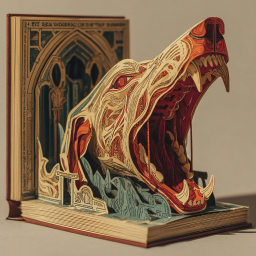
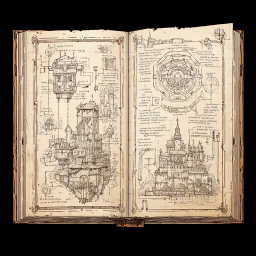
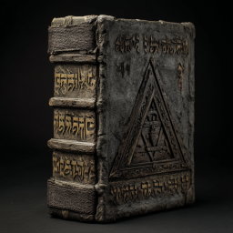
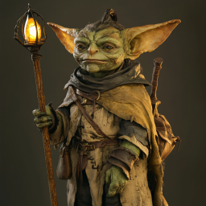
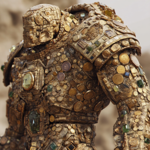
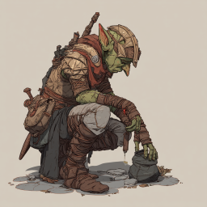
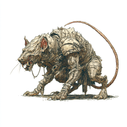
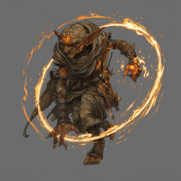
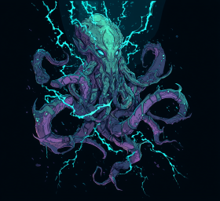

# Gåtefulle gobliner

## Lesehester

Dere lette gjennom biblioteket, og fant flere interessante bøker.

* En utbrettsbok med diverse illusjons-spells for gobliner.

* En slags arkitektbok om hvordan få mer ut av magiske bygninger. 

I tillegg fant dere en religiøs bok, som dere ikke helt klarte å finne ut av. Den var skrevet på et merkelig språk.

## Endelig, skattkammeret!

Neste dør ledet til et skattekammer. Det var fullt av kister med mynter og juveler. En liten goblin satt i en kiste der inne. Dere angrep ham, men før dere fikk drept ham, gjorde han noe som førte til at myntene begynte å samle seg til en skapning. Så drepte dere ham, men blodet hans ble sugd inn i gullskapningen og gjorde den bare enda sintere! Til slutt drepte dere den likevel, og tok med dere noen av de mer verdifulle juvelene dere fant.

## Troferommet

Dere gikk videre til neste dør og fant et rom fullt av forskjellige trofeer, noen stilige troner. En goblin voktet rommet, sammen med to forvokste rotter. Dere drepte dem og undersøkte trofeene. To av dem forestilte stiliserte ansikter, en mann og en kvinne. Da dere så nærmere på dem begynte de å spørre dere gåter, men det viste seg at de var mest opptatt av å be dere om å redde dem. De sa at de var fanget under dekk i et rom med rør, og at levende skygger sugde livskraften ut av dem.

## Laboratoriet

En ensom goblin stod og jobbet med noen gjenstander da dere kom inn i dette rommet. Med en lang metallgjenstand tilkalte han en svevende skapning av lyn, som dere også måtte slåss mot. Men etter at dere hadde drept goblinen, ble lynskapningen mer vennlig, og den delte et bilde av fremtiden med Dan; å gå ned under dekk for å redde skapningene med gåtene, ville både være gunstig og farlig.

Dere løp bortover, og kom dere ned trappen. Der var det et stort rom, med digre rør ned fra taket, og et merkelig mønster på gulvet med pulserende juveler. To gobliner voktet rommet.