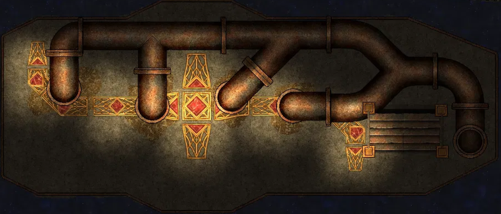
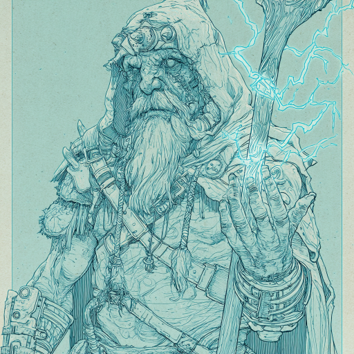

# Ilnan blir frelst

Dere kom ned i det store rommet under dekk som maskene på veggen i troférommet hadde ledet dere til. Det luktet rust, men også knust stein. Et par goblins med noen merkelige pinner voktet rommet, men dere tok dere raskt av dem. Den ene fikk ropt alarm, men det kom bare en goblin ned for å undersøke, og han tok dere dere av.

Gulvet var dekorert med et intrikat mønster, som også inneholdt 13 edelstener i forskjellige størrelser. Ned mot gulvet gikk det store metallrør. Dere brukte et kubein til å knekke opp det ene røret, og en skyggeskapning kom ut. Den ga dere ganske tøff motstand, men dere overvant den.

Deretter begynte dere å knuse juvelen, og fra hver juvel unnslapp det en gjennomsiktig ånd, noen voksne og noen barn - de var menneske-lignende, veldige brede og kraftige i kroppsform. Nesten alle hadde skjegg. Før de kom seg unna, kom det tre skyggeskapninger til fra rørene, og de begynte å fortære åndene. Dere klarte ikke å redde alle, men de som var igjen, velsignet dere på forskjellige måte. 

Den største av dem, en gammel skjeggete mann som kalt seg Hrothir the Ever-Forged, sa at alle hans tilbedere lenge hadde vært døde, og han trengte en ny følger. Ilnan sa at han ville følge Hrothir, og han fikk da en aura rundt seg som hjelper alle hans allierte. Så forsvant de, og nesten med en gang bikket hele skipet litt over på siden, og dere hørte et voldsomt spetakkel fra hoveddekket. 