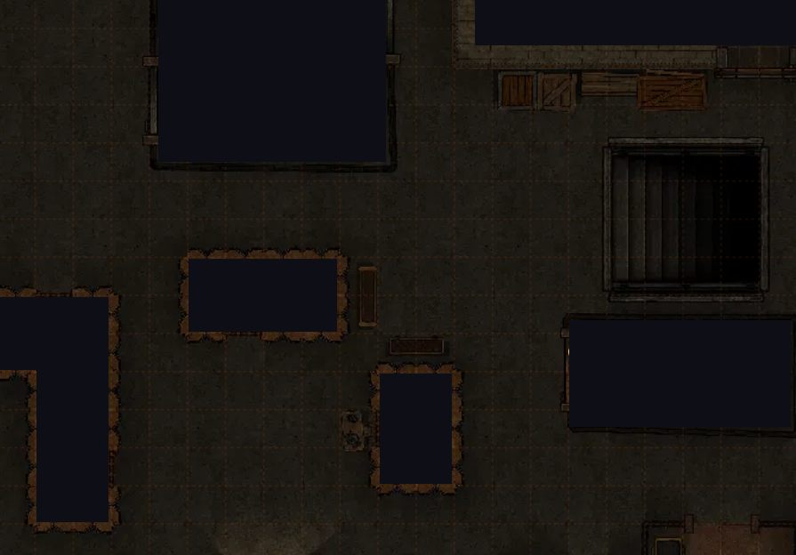
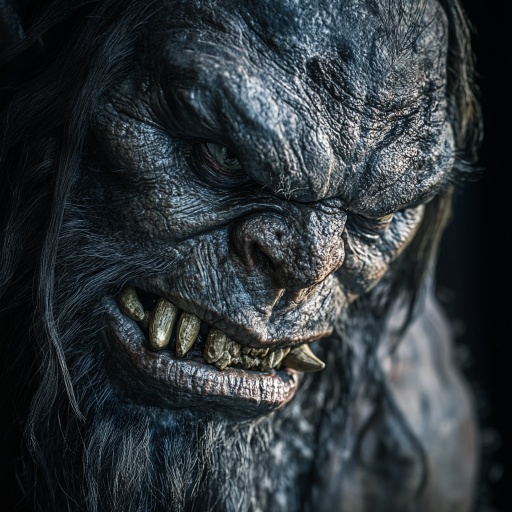

# Mosh pit

Etter at åndene var rømt, vippet hele skipet noen grader mot babord, og dere hørte alarmer i tillegg til rop og brøl fra hoveddekket. Da dere kom opp trappen, var en gjeng med troll allerede på vei mot dere i fullt firsprang. Det var et ekstra stort troll med grålig hud og rustning som ledet an, og så kom det fire litt mindre troll bak. Det var også forskjellige goblins, men de holdt litt avstand til trollene.

Sjefstrollet løp bort til dere og kom med et brøl som satte skrekken i flere av dere. De andre trollene plasserte seg også rundt dere. Uxmal fikk plassert en vegg av flammer gjennom alle trollene, og Ilnan plasserte en askesky (kreftene fra Tzitzimime). Det hjalp godt mot hovedtrollet, som var sårbar for ild. Men de andre trollene drev og regenererte opp igjen hver gang dere skadet dem. Dere skjønte at dere trengte syre for å hindre dem i å helbrede seg. 

Dere ble slått ned flere ganger, men kom dere opp igjen hver gang. En gang skjedde det med hjelp fra Kenai, ånden dere frigjorde fra det første skipet dere bordet. Uxmal kunne gi litt av sin helse til Galem, så han kom til bevissthet igjen.

En liten goblin forsøkte å stikke Dan mens han lå nede, men ombestemte seg og stjal en kanonkule fra et dødt troll i stedet. Det kom også en goblin som hadde mektig gudemagi. Han klarte å forvirre Dan så han begynte å angripe dere andre, men Galem ga ham en klessing så han ble seg selv igjen. Uxmal tilkalte en ild-drake, som hjalp til å drepe sjefstrollet, men de andre trollene var fortsatt en stor trussel. I tillegg til å bite dere, og kutte dere opp med klørne sine, kunne de også kaste kanonkuler på dere med en voldsom kraft.

Dan måtte helbrede i alle retninger. I et desperat øyeblikk aktiverte Uxmal frukten fra tre-ånden Kakaw. Den gjorde at dere alle fikk torner som stakk ut av huden! Uxmal tilkalte også en enhjørning. Da vokste tornene og ble kraftigere! Enhjørningen hjalp til med helbredelse, før den ble slått ned av et troll. Tornene gjorde ganske mye skade på alle som angrep dere i nærkamp.

Til slutt klarte dere endelig å ta dem alle trollene, ved å bruke noen små flasker med syre som Ilnan hadde med seg. Dere jagde også vekk noen andre goblins og hobgoblins som hadde sneket seg innpå dere.