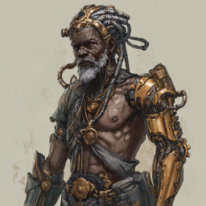
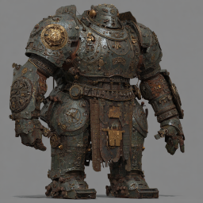
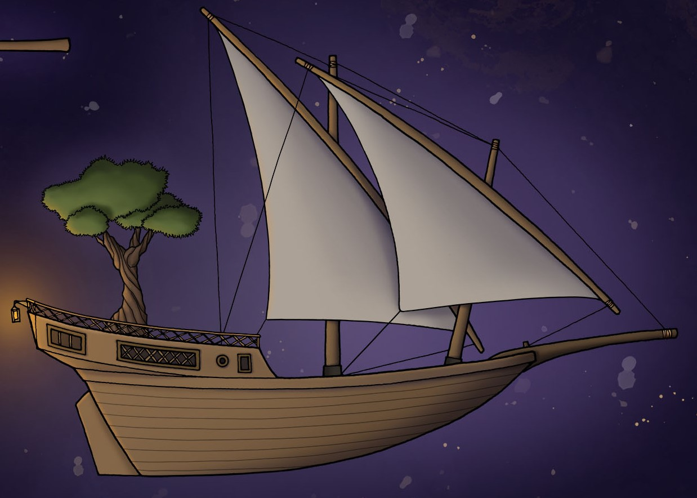

# Inter Homines et Machinas

## Dag 150

Dere våknet i den magiske bygningen som Uxmal hadde tryllet fram. Alle var litt ekstra entusiastiske etter å ha lekt med de forskjellige kjemikaliene i ekstrarommet som han hadde fått fram med den mystiske boken fra biblioteket.

Dere utforsket litt mer på hoveddekket, og fant et rom med mange kanoner. En liten goblin var der også, dere drepte ham og tok med dere noen små poser med krutt.

Deretter klarte dere å få opp dørene inn til de to rommene nær den største inngangen. I det ene var det ikke så mye spennende, men i det andre var det en luke ned under hoveddekket. Der nede fant dere noen store tanker, noen med vann, andre med salt og olje. En av tankene hadde et stort svart kryss. Dere fant også et rom med noen senger og et skrivebord, og en luke videre ned. 

Dere gikk ned, til et ganske lite rom helt nederst i skipet. Der møtte dere på en merkelig fyr som var halvt menneske og halvt maskin. Han snakket på et språk som minnet om deres eget morsmål, men dere skjønte likevel ikke helt hva han sa. Han stod og klargjorde flere av de store "tårnene" som hadde gjort så stor skade på bakken. Dere angrep ham, og det ble en hard kamp, særlig etter at han tilkalte en enorm tungsten-golem. Dere klarte til slutt å drepe mennesket, sperre inne golemen i en magisk steinvegg, og unnslippe opp til dekket over. Dere fikk med dere noen av de mekaniske kroppsdelene hans.

 

Der gikk dere framover i skipet, fant forskjellige lagringsområder, og så et merkelig skue. Et helt skip var i det neste rommet, festet til tak og vegger. Et stort tre vokste i skipet, og da dere kom ombord sang det en sang til dere:

    We sailed where stars and silence meet,
    With branches wide and roots beneath.

    But iron came with teeth and flame,
    And tore us down in greed and shame.

    Some were lost, and fed the ground,
    The rest in cages now are bound.

    Yet still my sap and spirit burn
    Give us hope… and we shall return.

