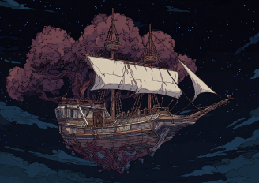

# Rockestjerner

Det var nøyaktig 150 dager siden dere kjempet dere til land fra det synkende skipet deres.

Dere hadde funnet det store skipet med treet nede i kjølen på goblinenes moderskip. Dere skjønte at det måtte være skipet til Krambal og de andre druidene. Det var lenket fast til moderskipet med store kjettinger, men dere så også at det var dører i veggene, så dere tenkte at det måtte være mulig å få det ut. Mens dere planla, kom Krambal med de to andre druidene på slep. Det virket som de hadde våknet litt fra dvalen, men bare akkurat nok til å slepe beina etter seg. Ilnan hjalp til å bære dem opp på dekk, og der forsvant begge to inn i treet. Krambla grep solid tak i armen til Ilnan og pekte ut, så forsvant også han inn. Da sang treet en ny sang:

 > Where roots have touched and branches grown, 
 > My soul may leap from bark to bone.
 > 
 > Not bound by sky, nor wall, nor flame, 
 > But drawn to trees that call my name.
 > 
 > Give me time and I shall fall, 
 > Through earth and dream and planar call.
 > 
 > Though hull may break, and wood may burn, 
 > The heart shall fly, and still return.
 >
 > Plant the will and speak the sound, 
 > And I shall bloom on distant ground.

Med samarbeid klarte dere å åpne de to store dørene, og dere fikk løsnet alle lenkene. Skipet balanserte nå bare på noen enkle metallstativer. Uxmal tilkalt en dryade, som kunne snakke med treet og fortalte at en mektig magi var plassert i dette skipet. Det kunne reise mellom planene, så lenge det var et tre på destinasjonen.

Dere forsøkte å forstå mer av denne kraften, og det ble tydelig at det også var mulig å styre skipet gjennom luften ved hjelp av tankens kraft. Galem fikk kontroll, og tok skipet ut gjennom døren. Niim la merke til at resten av armadaen, som nærmet seg i det fjerne, begynte å komme nær nok til å skyte de digre golemtårnene som forårsaket så stor ødeleggelse, ned mot bakken. Det begynte å haste.

Så snart dere var klare, begynte dere å ødelegge de store ballongene som fortsatt hang over moderskipet. Nesen bikket forover, og det styrtet nedover. Det forsvant gjennom skylaget, og ganske raskt hørte og så dere en massiv eksplosjon der nede. I Uxmals hode skrek dragesjelen i smerte, og forsvant gradvis etter hvert som restene av moderskipet sank mot havbunnen.

I det fjerne kunne dere med en kikkert fra druidenes skip se at resten av armadaen stoppet opp og la seg avventende med bredsiden mot dere. Dere var bekymret for kanoner, men det virket som de reagerte med varsomhet etter moderskipets ødeleggelse.

Dere ventet litt, usikker på hva dere skulle gjøre videre, men samtidig:

<i>Dypt inne i steinspiret sprekker skallet på det eldgamle egget med et blendende lys. En perlemor-drage — verken helt fysisk eller ånd — reiser seg og slipper ut et brøl som blir til en bølge av lys, pulserende over himmelen. Den gamle dragen som ligger kveilet rundt tårnet får endelig hvile, og forsvinner i et blaff. Bare en innbrent skygge viser hvor den lå. Alle dens krystaller pulveriseres og blåser vekk i vinden.</i>
    
<i>Goblinenes skip, som brukte krystallene som drivstoff, vakler, deres motorer destabiliseres. Noen ballonger utløses, men det er ikke nok. Det er som om selve himmelen trekker pusten lettet. Victor, mannen fra fremtiden, i Xavez sin kropp, som har voktet egget, faller sammen i utmattelse, og forsvinner deretter, etter sin siste tidsreise. Så våkner han, men ikke i en krystallsarkofag, men en seng. Han reiser seg, og ser ut vinduet, som han åpner. Utenfor er det åkre og veier og skoger. Han ser geitemenn og mennesker som jobber sammen med å bringe inn avlingen. En geitekvinne roper til ham, "Victor, kom og hjelp til din syvsover."</i>

Samtidig:

<i>Langt borte fra slagmarkene, under den steinlagte byen der dronning Nicté hersker over de døde, stopper alle de udøde opp, vare på at noe har endret seg. Hun samler dem og de begynner på en lang marsj.</i>

Dere fløy under Galem sin kontroll druideskipet ned til steinspiret, hvor dere fant nye ødeleggelser, men også noen overlevende geitemenn, og de andre medlemmene fra mannskapet. Eneste unntaket var kirugen Farrow, som hadde gått i skjul for å føde barnet sitt med geitemannen. Dere så litt etter henne uten hell, men tok så med de andre østover til hjemlandet dere. Endelig, etter alle strabasene, var det kommet hjem. 

Også der var det ødeleggelser, men gjenoppbyggingen begynte raskt. Galem og Dan dro hjem til sine familier, mens Uxmal og Ilnan seilte rundt på druidenes skip. 

Etter et halvt år kom Krambal ut av treet, han takket dere for hjelpen. Uxmal og Ilnan valgte, etter å ha tatt farvel med sine venner, å følge Krambal. Han tok kontroll over skipet og leder dere til et fjernt sted:

<i>Skipet glir over terskelen mellom verdener som en rot som finner vann. Luften blir straks kjøligere, renere. Det lukter fuktig jord, bartrær og noe søtt — som blomster som bare blomstrer én gang hvert århundre.</i>

<i>Treet sukker tungt, nesten lykkelig, idet det lander, og røttene finner næring i et land det kjenner igjen.</i>

<i>Under dere breier et grønt kontinent seg ut, dekket av eldgamle skoger, tåkete daler og glitrende innsjøer. Overalt stiger massive trær mot skyene — noen med plattformer og broer av levende vinranker. Druidiske steinsirkler lyser svakt i dypet.</i>

<i>Fugler i alle farger danser mellom grenene. Og når skipet lander, strømmer det ut små dyr som om de har ventet i generasjoner. De andre to druidene kommer ut fra treet, søvndrukne men friske. En eldgammel ugle svever sakte ned med tunge vingeslag, og snakker:</i>

<i>"Dere har kommet tilbake. Vi trodde dere var tapt for alltid."</i>

<h1>
THE END
</h1>

<i>Nicté leder en siste seremoni ved cenoten. Hun åpner veien for tusenvis av sjeler til å forlate verden i fred. Jungelen er stille den natten — ingen stemmer, ingen klager. Et tempel bygges i hennes navn, ikke voktet av krigere, men av blomstrende vinranker.</i>

---

<i>Under et hellig fossefall, dypt inne i jungelen, samles noen av de overlevende åndene: Ixkayotl (frost), Yaku (vann), Tonatiuh (sol), og den reinkarnerte Tepeu (ild/leopard). For første gang på tusenvis av år synger deres krefter i harmoni. De lover hverandre å vokte balansen som en gang fantes. Et rituelt bånd knyttes mellom deres domener. Der goblinene etterlot arr, spirer nå frø, is glitrer, elver flyter, og stjernene skifter retning. En ny tid er i emning — hvis man våger å pleie den.</i>

---

<i>Etter at stormene har forsvunnet, kommer det slitne utforskere fra øst. De overlevende geitemennene tar mot dem på stranden dere selv først gikk i land på, og gir dem frukt.</i>
